# Figure gallery

Every figure the analysis produces, grouped by question. Generated by `scripts/build_figure_catalog.py` from
[`figures/catalog.tsv`](figures/catalog.tsv) — edit the TSV (for example the `paper` column), then run
`python run.py --steps catalog`.

How to read the entries:

* **RECONSTRUCTION** — the code that drew the original was lost; the script was rebuilt so that every value printed on the
  original figure is reproduced (see [docs/PROVENANCE.md](docs/PROVENANCE.md)).
* **Recovered script** — the original code was recovered from session records and runs unchanged apart from paths.
* **Alternative exon** — present in some but not all of the gene's mapped transcripts (see the README).
* p-values are uncorrected for multiple testing unless the entry says otherwise.
* *Poster* marks panels used on the 2026 QCB SURP poster.

75 figures:

* [A. Cohort, transcript mapping and IDR inventory](#cohort-transcript-mapping-and-idr-inventory) — A1, A2, A3, A4, A5
* [B. TFs vs non-TFs: disorder content and IDR properties](#tfs-vs-non-tfs-disorder-content-and-idr-properties) — B1, B2, B3, B4, B5, B6, B7, B8, B9
* [C. Disorder variation across a gene's isoforms](#disorder-variation-across-a-genes-isoforms) — C1, C2, C3, C4, C5, C6, C7, C8, C9, C10, C11, C12, C13
* [D. TF families and protein families](#tf-families-and-protein-families) — D1, D2, D3, D4, D5, D6, D7, D8
* [E. Gene age](#gene-age) — E1, E2, E3, E4, E5, E6, E7, E8, E9, E10, E11, E12, E13, E14, E15, E16
* [F. Where IDRs sit in proteins and exons](#where-idrs-sit-in-proteins-and-exons) — F1, F2, F3, F4, F5, F6, F7
* [G. Alternative splicing and IDRs](#alternative-splicing-and-idrs) — G1, G2, G3, G4, G5, G6, G7, G8, G9, G10, G11, G12, G13
* [H. Function: GO enrichment (cluster only)](#function-go-enrichment-cluster-only) — H1, H2, H3, H4

## Cohort, transcript mapping and IDR inventory

| ID | Figure | Poster | Paper |
|---|---|---|---|
| [A1](#a1) | Isoform attrition funnel |  |  |
| [A2](#a2) | Isoform-to-transcript resolution status |  |  |
| [A3](#a3) | IDR inventory of the MAIN set |  |  |
| [A4](#a4) | IDR segments per isoform |  |  |
| [A5](#a5) | IDR segment count: TF vs non-TF, canonical vs alternative |  |  |

### A1

**Isoform attrition funnel**

<a href="figures/genomic/fig01_attrition_funnel.pdf">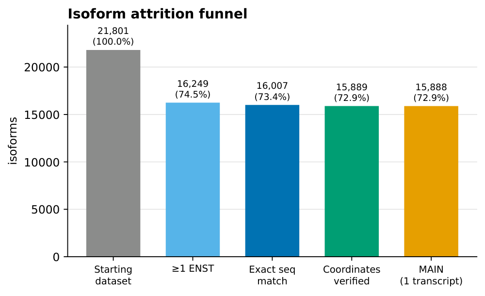</a>

| | |
|---|---|
| File | [`figures/genomic/fig01_attrition_funnel.pdf`](figures/genomic/fig01_attrition_funnel.pdf) |
| Shows | Isoforms retained at each genomic-mapping step: cohort 21,801; >=1 Ensembl transcript 16,249; exact sequence match 16,007; coordinates verified 15,889; MAIN (one resolved transcript) 15,888. |
| Statistics | Counts only. |
| Made by | `scripts/figures/genomic_preliminary_fig01_to_fig12.py` |
| Notes | RECONSTRUCTION: the original code was lost; every value printed on the original figure is reproduced. Bars are not nested: MAIN and coordinate-verified sets overlap in 15,822 isoforms. |
| Poster | no |
| Paper | not decided |

### A2

**Isoform-to-transcript resolution status**

<a href="figures/genomic/fig_mapping_resolution_qc.pdf">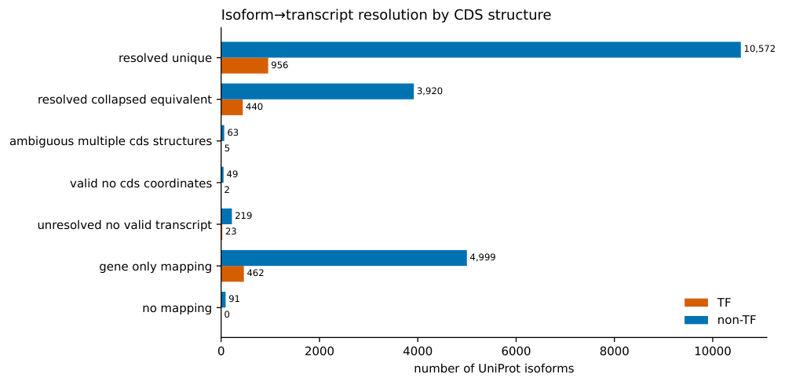</a>

| | |
|---|---|
| File | [`figures/genomic/fig_mapping_resolution_qc.pdf`](figures/genomic/fig_mapping_resolution_qc.pdf) |
| Shows | UniProt isoforms by transcript resolution class (resolved unique, UTR-collapsed equivalents, ambiguous, gene-only, ...), TF vs non-TF. |
| Statistics | Counts only. |
| Made by | `pipeline/tfidr_pipeline/mapping/resolve_isoform_transcripts.py` |
| Notes | QC figure. |
| Poster | no |
| Paper | not decided |

### A3

**IDR inventory of the MAIN set**

<a href="figures/genomic/fig02_idr_inventory.pdf">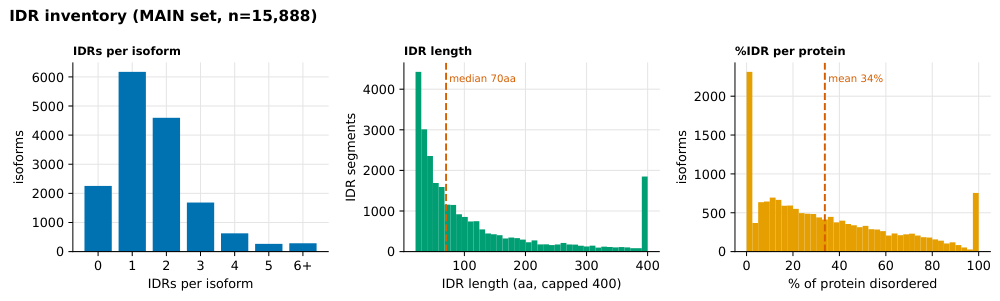</a>

| | |
|---|---|
| File | [`figures/genomic/fig02_idr_inventory.pdf`](figures/genomic/fig02_idr_inventory.pdf) |
| Shows | MAIN isoforms (15,888): IDRs per isoform, IDR segment length (median 70 aa), %IDR per protein (mean 34%). |
| Statistics | Descriptive. |
| Made by | `scripts/figures/genomic_preliminary_fig01_to_fig12.py` |
| Notes | RECONSTRUCTION: the original code was lost; every value printed on the original figure is reproduced. |
| Poster | no |
| Paper | not decided |

### A4

**IDR segments per isoform**

<a href="figures/proteome_extended/fig_age8_n_idr_segments_histogram.pdf">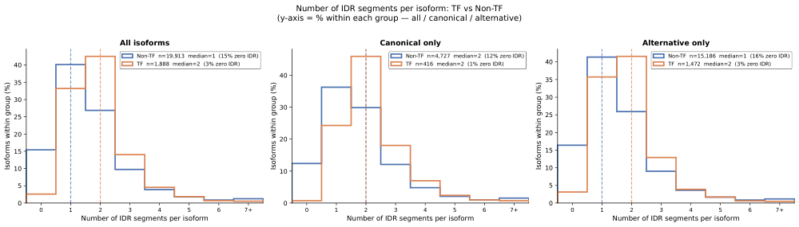</a>

| | |
|---|---|
| File | [`figures/proteome_extended/fig_age8_n_idr_segments_histogram.pdf`](figures/proteome_extended/fig_age8_n_idr_segments_histogram.pdf) |
| Shows | Distribution of IDR segment counts per isoform, TF vs non-TF, for all / canonical / alternative isoforms (median 2 in TFs, 1 in non-TFs; 3% vs 15% of isoforms have no IDR). |
| Statistics | Descriptive. |
| Made by | `notebooks/05_proteome_analysis_extended` |
| Notes | — |
| Poster | no |
| Paper | not decided |

### A5

**IDR segment count: TF vs non-TF, canonical vs alternative**

<a href="figures/proteome/fig7A_n_idr_segments_tf_canonical.pdf">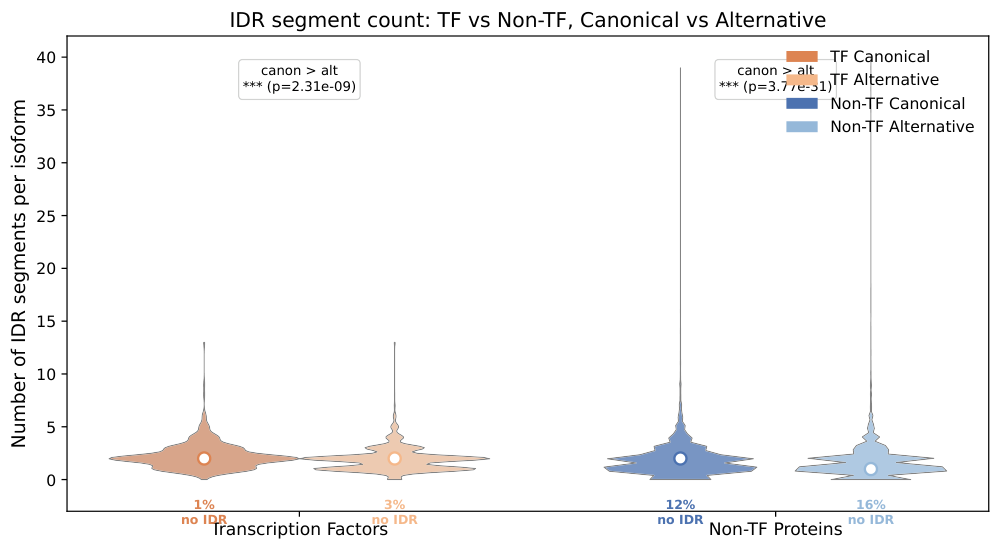</a>

| | |
|---|---|
| File | [`figures/proteome/fig7A_n_idr_segments_tf_canonical.pdf`](figures/proteome/fig7A_n_idr_segments_tf_canonical.pdf) |
| Shows | Violins of IDR segments per isoform for TF/non-TF x canonical/alternative, with % of isoforms without an IDR (1%, 3%, 12%, 16%). |
| Statistics | Canonical vs alternative within group: MWU (TF p=2.3e-9; non-TF p=3.8e-31). |
| Made by | `notebooks/02_proteome_analysis` |
| Notes | Layout: the legend overlaps the non-TF p-value box. |
| Poster | no |
| Paper | not decided |

## TFs vs non-TFs: disorder content and IDR properties

| ID | Figure | Poster | Paper |
|---|---|---|---|
| [B1](#b1) | %IDR of canonical vs alternative isoforms, TF vs non-TF | yes |  |
| [B2](#b2) | As B1, IDR-containing isoforms only |  |  |
| [B3](#b3) | %IDR of canonical vs all isoforms, TF vs non-TF |  |  |
| [B4](#b4) | As B3, IDR-containing isoforms only |  |  |
| [B5](#b5) | TFs are more disordered (MAIN set) |  |  |
| [B6](#b6) | IDR segment length, TF vs non-TF |  |  |
| [B7](#b7) | IDR sequence properties, TF vs non-TF |  |  |
| [B8](#b8) | IDR biophysics per segment, TF vs non-TF |  |  |
| [B9](#b9) | Aromatic fraction vs charge fraction of IDRs |  |  |

### B1

**%IDR of canonical vs alternative isoforms, TF vs non-TF**

<a href="figures/proteome/fig2A_split_pct_idr_canon_vs_alt.pdf">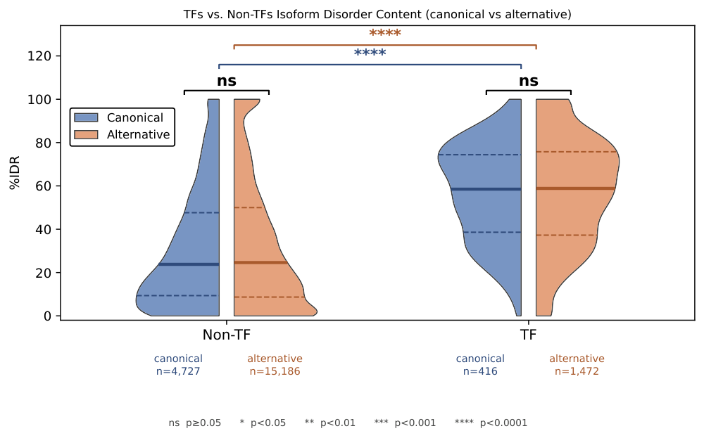</a>

| | |
|---|---|
| File | [`figures/proteome/fig2A_split_pct_idr_canon_vs_alt.pdf`](figures/proteome/fig2A_split_pct_idr_canon_vs_alt.pdf) |
| Shows | Split violins of %IDR per isoform: non-TF canonical 4,727 / alternative 15,186; TF canonical 416 / alternative 1,472. |
| Statistics | 4 two-sided MWU tests shown as stars (canonical vs alternative within group: ns, ns; TF vs non-TF: ****, ****); no multiple-testing correction. |
| Made by | `scripts/figures/fig2_canonical_vs_alternative_violins.py` |
| Notes | Recovered script. Poster version of B3. |
| Poster | yes |
| Paper | not decided |

### B2

**As B1, IDR-containing isoforms only**

<a href="figures/proteome/fig2B_split_pct_idr_canon_vs_alt.pdf">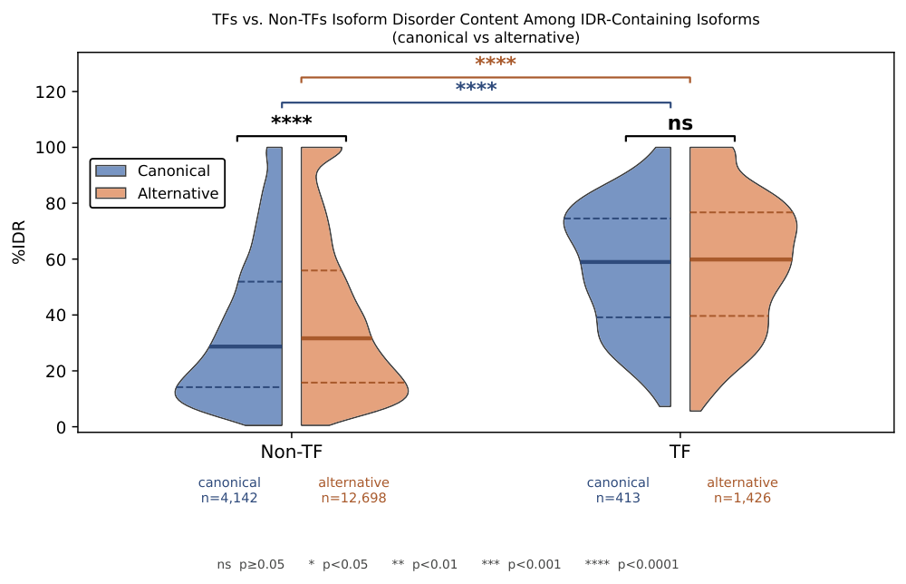</a>

| | |
|---|---|
| File | [`figures/proteome/fig2B_split_pct_idr_canon_vs_alt.pdf`](figures/proteome/fig2B_split_pct_idr_canon_vs_alt.pdf) |
| Shows | As B1 restricted to isoforms with >=1 IDR (non-TF 4,142 / 12,698; TF 413 / 1,426). |
| Statistics | 4 MWU tests as stars (non-TF canonical vs alternative ****, TF ns; TF vs non-TF ****, ****); uncorrected. |
| Made by | `scripts/figures/fig2_canonical_vs_alternative_violins.py` |
| Notes | Recovered script. |
| Poster | no |
| Paper | not decided |

### B3

**%IDR of canonical vs all isoforms, TF vs non-TF**

<a href="figures/proteome/fig2A_split_pct_idr_all_isoforms.pdf">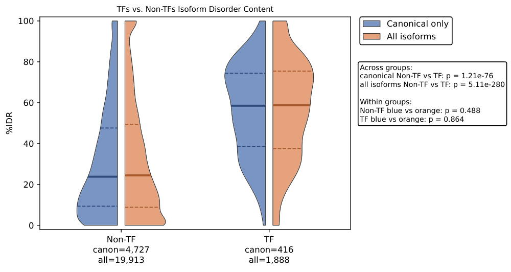</a>

| | |
|---|---|
| File | [`figures/proteome/fig2A_split_pct_idr_all_isoforms.pdf`](figures/proteome/fig2A_split_pct_idr_all_isoforms.pdf) |
| Shows | Split violins of %IDR: canonical isoforms vs all isoforms (canonical included), TF vs non-TF. |
| Statistics | MWU p-values in a text box (canonical TF vs non-TF p=1.2e-76; all isoforms p=5.1e-280; within group p=0.49 and 0.86). |
| Made by | `notebooks/02_proteome_analysis` |
| Notes | Earlier version of B1; the two halves overlap (canonical isoforms are part of 'all'). Prefer B1. |
| Poster | no |
| Paper | not decided |

### B4

**As B3, IDR-containing isoforms only**

<a href="figures/proteome/fig2B_split_pct_idr_WITHisoforms.pdf">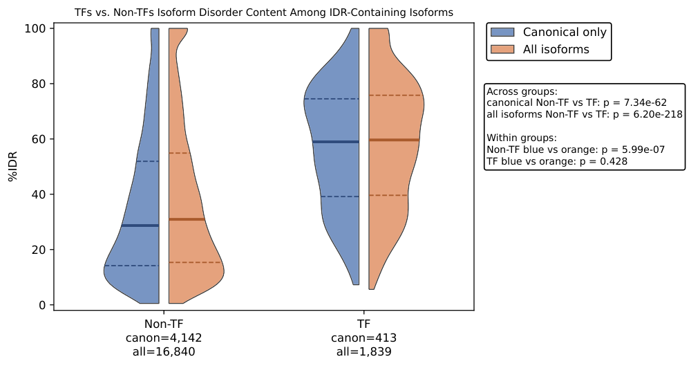</a>

| | |
|---|---|
| File | [`figures/proteome/fig2B_split_pct_idr_WITHisoforms.pdf`](figures/proteome/fig2B_split_pct_idr_WITHisoforms.pdf) |
| Shows | As B3 restricted to isoforms with >=1 IDR. |
| Statistics | MWU p-values in a text box. |
| Made by | `notebooks/02_proteome_analysis` |
| Notes | Earlier version of B2; overlapping halves. Prefer B2. |
| Poster | no |
| Paper | not decided |

### B5

**TFs are more disordered (MAIN set)**

<a href="figures/genomic/fig05_tf_vs_nontf.pdf">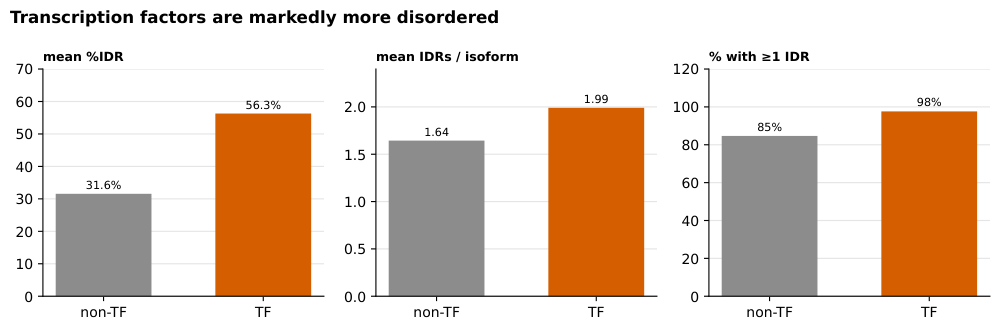</a>

| | |
|---|---|
| File | [`figures/genomic/fig05_tf_vs_nontf.pdf`](figures/genomic/fig05_tf_vs_nontf.pdf) |
| Shows | MAIN isoforms: mean %IDR 31.6% vs 56.3%, mean IDRs per isoform 1.64 vs 1.99, % with >=1 IDR 85% vs 98% (non-TF vs TF). |
| Statistics | Means only, no test. |
| Made by | `scripts/figures/genomic_preliminary_fig01_to_fig12.py` |
| Notes | RECONSTRUCTION: the original code was lost; every value printed on the original figure is reproduced. Same comparison as B1 on the mapped subset. |
| Poster | no |
| Paper | not decided |

### B6

**IDR segment length, TF vs non-TF**

<a href="figures/proteome_extended/figF_idr_segment_length.pdf">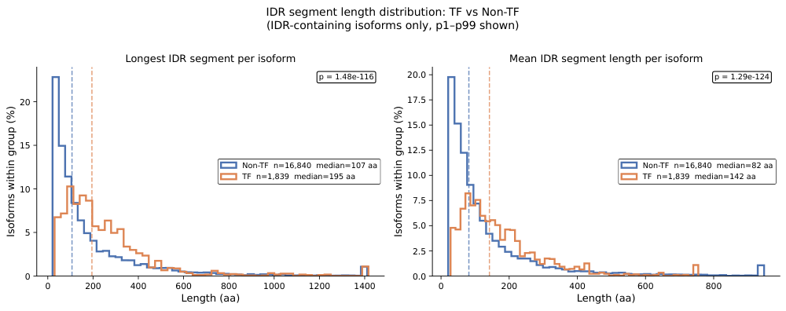</a>

| | |
|---|---|
| File | [`figures/proteome_extended/figF_idr_segment_length.pdf`](figures/proteome_extended/figF_idr_segment_length.pdf) |
| Shows | IDR-containing isoforms: longest IDR per isoform (median 195 vs 107 aa) and mean IDR length (142 vs 82 aa), TF vs non-TF. |
| Statistics | MWU (p=1.5e-116 and 1.3e-124). |
| Made by | `notebooks/05_proteome_analysis_extended` |
| Notes | — |
| Poster | no |
| Paper | not decided |

### B7

**IDR sequence properties, TF vs non-TF**

<a href="figures/proteome_extended/figD_biophysical_properties.pdf">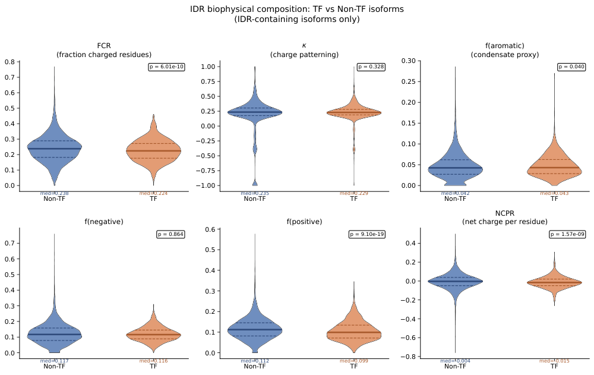</a>

| | |
|---|---|
| File | [`figures/proteome_extended/figD_biophysical_properties.pdf`](figures/proteome_extended/figD_biophysical_properties.pdf) |
| Shows | Per IDR-containing isoform: fraction charged residues, kappa, f(aromatic), f(negative), f(positive), NCPR (ALBATROSS/MetaPredict IDRome columns). |
| Statistics | MWU per property (6 tests, uncorrected): FCR p=6.0e-10, kappa 0.33, aromatic 0.040, f(-) 0.86, f(+) 9.1e-19, NCPR 1.6e-9. |
| Made by | `notebooks/05_proteome_analysis_extended` |
| Notes | — |
| Poster | no |
| Paper | not decided |

### B8

**IDR biophysics per segment, TF vs non-TF**

<a href="figures/genomic/fig08_idr_biophysics.pdf">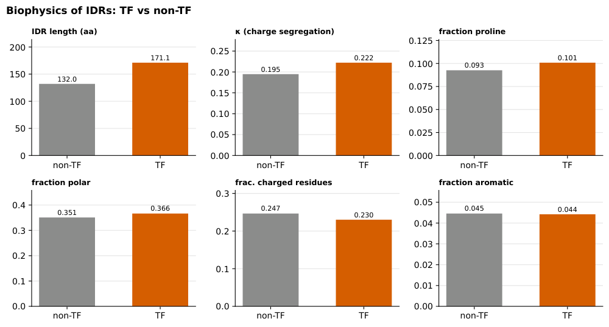</a>

| | |
|---|---|
| File | [`figures/genomic/fig08_idr_biophysics.pdf`](figures/genomic/fig08_idr_biophysics.pdf) |
| Shows | Mean over IDR segments of MAIN isoforms: length 132 vs 171 aa, kappa 0.195 vs 0.222, fraction proline, polar, charged, aromatic. |
| Statistics | Means only, no test. |
| Made by | `scripts/figures/genomic_preliminary_fig01_to_fig12.py` |
| Notes | RECONSTRUCTION: the original code was lost; every value printed on the original figure is reproduced. Segment-level counterpart of B7. |
| Poster | no |
| Paper | not decided |

### B9

**Aromatic fraction vs charge fraction of IDRs**

<a href="figures/proteome_extended/figE_condensate_scatter.pdf">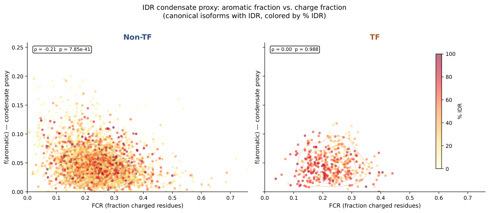</a>

| | |
|---|---|
| File | [`figures/proteome_extended/figE_condensate_scatter.pdf`](figures/proteome_extended/figE_condensate_scatter.pdf) |
| Shows | Canonical isoforms with an IDR: f(aromatic) against FCR, coloured by %IDR, non-TF and TF panels. |
| Statistics | Spearman: non-TF rho=-0.21 (p=7.9e-41); TF rho=0.00 (p=0.99). |
| Made by | `notebooks/05_proteome_analysis_extended` |
| Notes | — |
| Poster | no |
| Paper | not decided |

## Disorder variation across a gene's isoforms

| ID | Figure | Poster | Paper |
|---|---|---|---|
| [C1](#c1) | Within-gene %IDR variation, TF vs non-TF |  |  |
| [C2](#c2) | As C1, genes with an IDR in any isoform |  |  |
| [C3](#c3) | Mean %IDR and %IDR range by isoform count |  |  |
| [C4](#c4) | Isoform count vs mean %IDR and %IDR range |  |  |
| [C5](#c5) | More isoforms, more IDR variation? |  |  |
| [C6](#c6) | Where the canonical isoform falls in its gene's %IDR range |  |  |
| [C7](#c7) | Canonical isoform's %IDR rank within its gene |  |  |
| [C8](#c8) | How representative is the canonical isoform? |  |  |
| [C9](#c9) | Direction of %IDR change in alternative isoforms |  |  |
| [C10](#c10) | Are canonical isoforms longer than their alternatives? |  |  |
| [C11](#c11) | TF isoform length relative to canonical |  |  |
| [C12](#c12) | TF alternative isoforms that lose or gain IDR segments |  |  |
| [C13](#c13) | Genes with the largest within-gene %IDR range |  |  |

### C1

**Within-gene %IDR variation, TF vs non-TF**

<a href="figures/proteome/fig1A_pct_change_idr.pdf">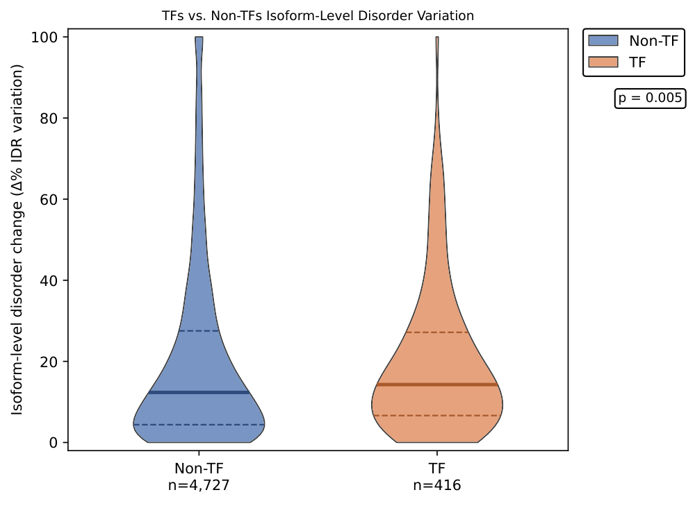</a>

| | |
|---|---|
| File | [`figures/proteome/fig1A_pct_change_idr.pdf`](figures/proteome/fig1A_pct_change_idr.pdf) |
| Shows | One point per gene: %IDR range (max - min over its isoforms); TF 416 vs non-TF 4,727 genes. |
| Statistics | Two-sided MWU p=0.005. |
| Made by | `notebooks/02_proteome_analysis` |
| Notes | — |
| Poster | no |
| Paper | not decided |

### C2

**As C1, genes with an IDR in any isoform**

<a href="figures/proteome/fig1B_pct_change_idr_WITHisoforms.pdf">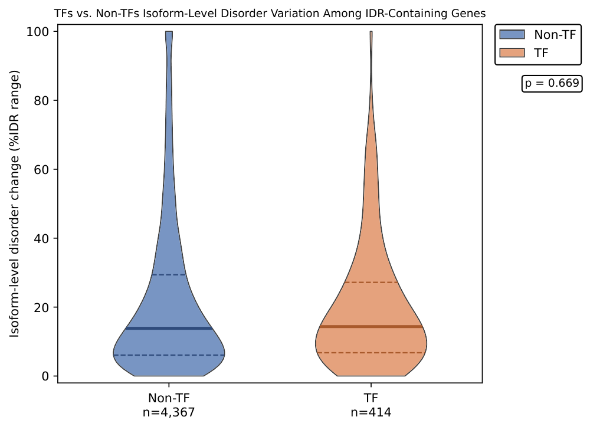</a>

| | |
|---|---|
| File | [`figures/proteome/fig1B_pct_change_idr_WITHisoforms.pdf`](figures/proteome/fig1B_pct_change_idr_WITHisoforms.pdf) |
| Shows | As C1 for genes with >=1 IDR in any isoform (TF 414, non-TF 4,367). |
| Statistics | MWU p=0.669. |
| Made by | `notebooks/02_proteome_analysis` |
| Notes | Restricting to genes with an IDR removes the difference seen in C1. |
| Poster | no |
| Paper | not decided |

### C3

**Mean %IDR and %IDR range by isoform count**

<a href="figures/proteome/fig3A_combined_mean_and_range_pct_idr.pdf">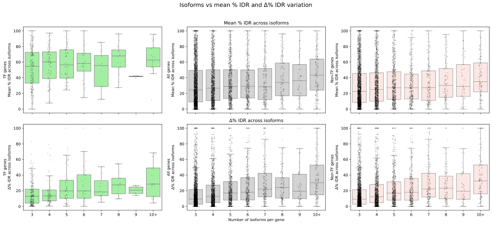</a>

| | |
|---|---|
| File | [`figures/proteome/fig3A_combined_mean_and_range_pct_idr.pdf`](figures/proteome/fig3A_combined_mean_and_range_pct_idr.pdf) |
| Shows | Box + strip plots of gene mean %IDR and %IDR range by number of isoforms (3 to 10+), for TF genes, all genes and non-TF genes. |
| Statistics | Descriptive; strip jitter seeded. |
| Made by | `notebooks/02_proteome_analysis` |
| Notes | — |
| Poster | no |
| Paper | not decided |

### C4

**Isoform count vs mean %IDR and %IDR range**

<a href="figures/proteome/fig3B_meanidr_rangeidr_linearregress.pdf">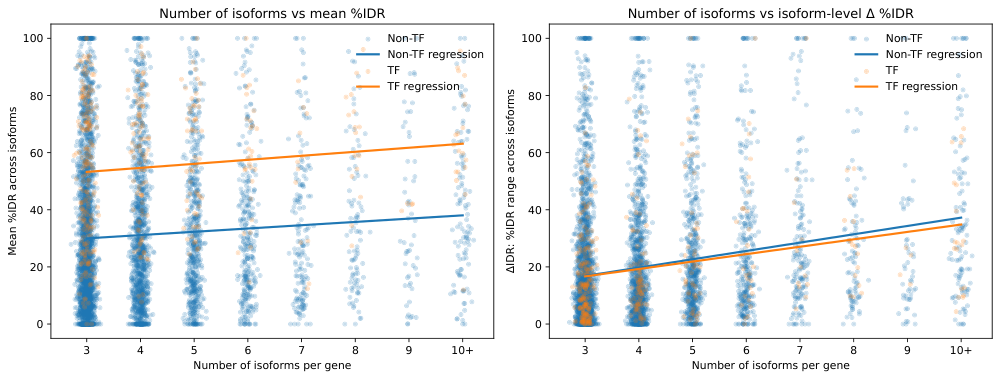</a>

| | |
|---|---|
| File | [`figures/proteome/fig3B_meanidr_rangeidr_linearregress.pdf`](figures/proteome/fig3B_meanidr_rangeidr_linearregress.pdf) |
| Shows | One point per gene: number of isoforms vs mean %IDR and vs %IDR range, with TF and non-TF regression lines. |
| Statistics | OLS regression lines (statsmodels). |
| Made by | `notebooks/02_proteome_analysis` |
| Notes | — |
| Poster | no |
| Paper | not decided |

### C5

**More isoforms, more IDR variation?**

<a href="figures/proteome_extended/figB_nisoforms_vs_pct_change_idr.pdf">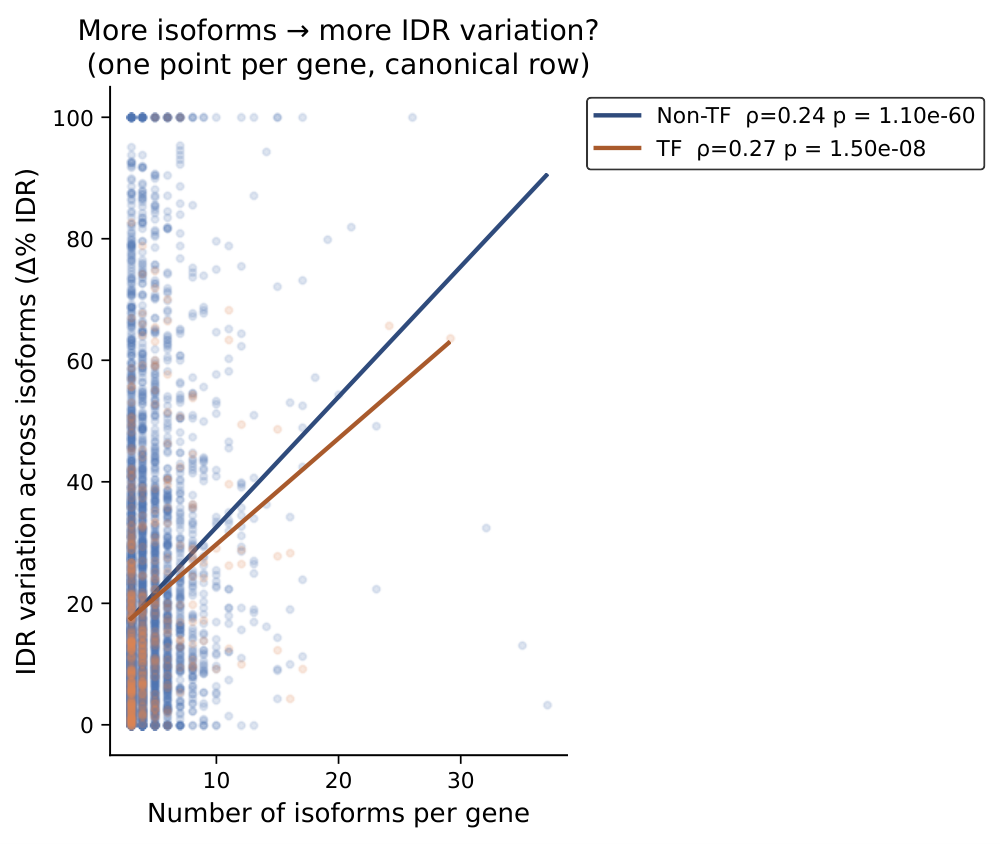</a>

| | |
|---|---|
| File | [`figures/proteome_extended/figB_nisoforms_vs_pct_change_idr.pdf`](figures/proteome_extended/figB_nisoforms_vs_pct_change_idr.pdf) |
| Shows | One point per gene: number of isoforms vs %IDR range, TF and non-TF fits. |
| Statistics | Spearman: non-TF rho=0.24 (p=1.1e-60); TF rho=0.27 (p=1.5e-8). |
| Made by | `notebooks/05_proteome_analysis_extended` |
| Notes | Overlaps C4. |
| Poster | no |
| Paper | not decided |

### C6

**Where the canonical isoform falls in its gene's %IDR range**

<a href="figures/proteome/fig6A_canonical_position.pdf">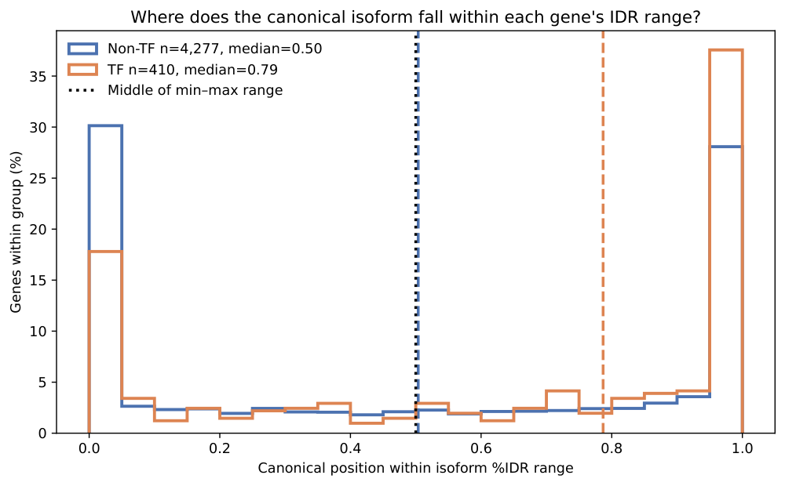</a>

| | |
|---|---|
| File | [`figures/proteome/fig6A_canonical_position.pdf`](figures/proteome/fig6A_canonical_position.pdf) |
| Shows | Position of the canonical %IDR within each gene's min-max isoform range (0 = least, 1 = most disordered isoform); median 0.79 for TF genes (410) vs 0.50 for non-TF (4,277). |
| Statistics | Descriptive. |
| Made by | `notebooks/02_proteome_analysis` |
| Notes | — |
| Poster | no |
| Paper | not decided |

### C7

**Canonical isoform's %IDR rank within its gene**

<a href="figures/proteome_extended/figC_canonical_idr_rank.pdf">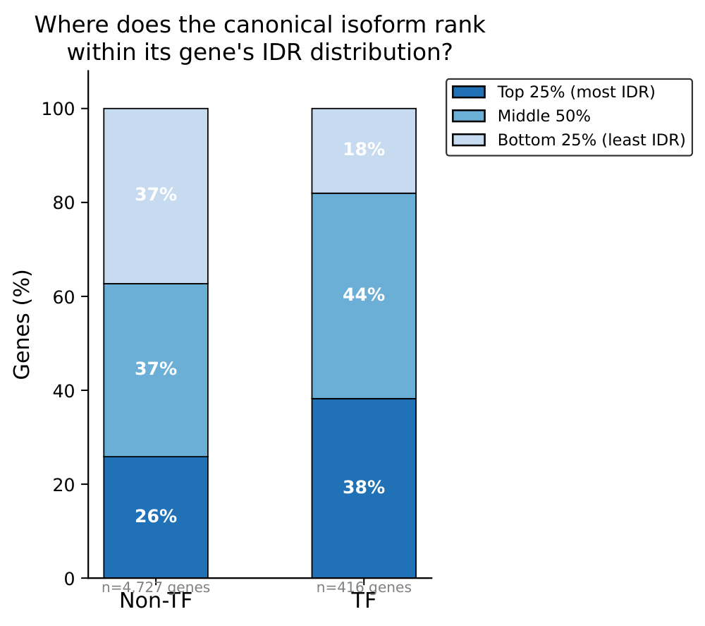</a>

| | |
|---|---|
| File | [`figures/proteome_extended/figC_canonical_idr_rank.pdf`](figures/proteome_extended/figC_canonical_idr_rank.pdf) |
| Shows | Share of genes whose canonical isoform is in the top 25% / middle 50% / bottom 25% of the gene's isoforms by %IDR (TF 38/44/18%; non-TF 26/37/37%). |
| Statistics | Descriptive. |
| Made by | `notebooks/05_proteome_analysis_extended` |
| Notes | Overlaps C6. |
| Poster | no |
| Paper | not decided |

### C8

**How representative is the canonical isoform?**

<a href="figures/proteome/fig6B_canonical_representativeness.pdf">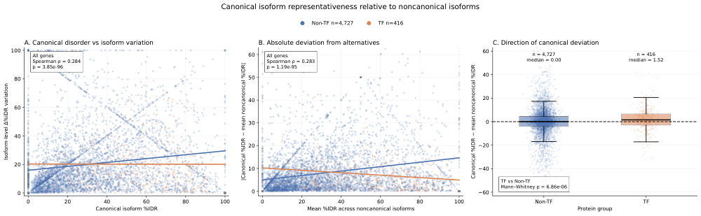</a>

| | |
|---|---|
| File | [`figures/proteome/fig6B_canonical_representativeness.pdf`](figures/proteome/fig6B_canonical_representativeness.pdf) |
| Shows | A: canonical %IDR vs gene %IDR range; B: \|canonical - mean non-canonical %IDR\|; C: signed deviation, TF (416) vs non-TF (4,727). |
| Statistics | Spearman (A rho=0.28, B rho=0.28 over all genes); MWU TF vs non-TF on C (p=6.9e-6); bootstrap seed 42. |
| Made by | `notebooks/02_proteome_analysis` |
| Notes | — |
| Poster | no |
| Paper | not decided |

### C9

**Direction of %IDR change in alternative isoforms**

<a href="figures/proteome_extended/figA_idr_change_direction.pdf">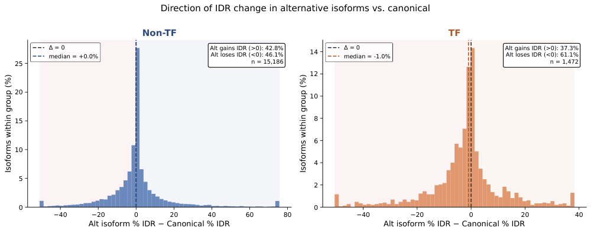</a>

| | |
|---|---|
| File | [`figures/proteome_extended/figA_idr_change_direction.pdf`](figures/proteome_extended/figA_idr_change_direction.pdf) |
| Shows | Alternative - canonical %IDR per alternative isoform: non-TF median 0.0 (46.1% lose, 42.8% gain; n=15,186); TF median -1.0 (61.1% lose, 37.3% gain; n=1,472). |
| Statistics | Descriptive. |
| Made by | `notebooks/05_proteome_analysis_extended` |
| Notes | — |
| Poster | no |
| Paper | not decided |

### C10

**Are canonical isoforms longer than their alternatives?**

<a href="figures/proteome/fig6C_canonical_length_delta.pdf">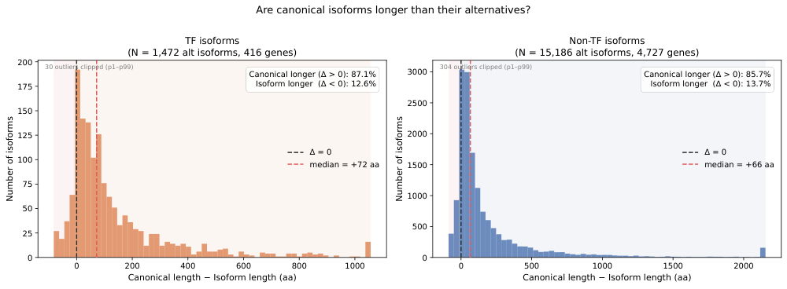</a>

| | |
|---|---|
| File | [`figures/proteome/fig6C_canonical_length_delta.pdf`](figures/proteome/fig6C_canonical_length_delta.pdf) |
| Shows | Canonical - alternative length per alternative isoform: TF median +72 aa (87.1% canonical longer); non-TF +66 aa (85.7%). p1-p99 shown. |
| Statistics | Descriptive. |
| Made by | `notebooks/02_proteome_analysis` |
| Notes | — |
| Poster | no |
| Paper | not decided |

### C11

**TF isoform length relative to canonical**

<a href="figures/proteome/tf_canonical_vs_isoform_length_delta.pdf">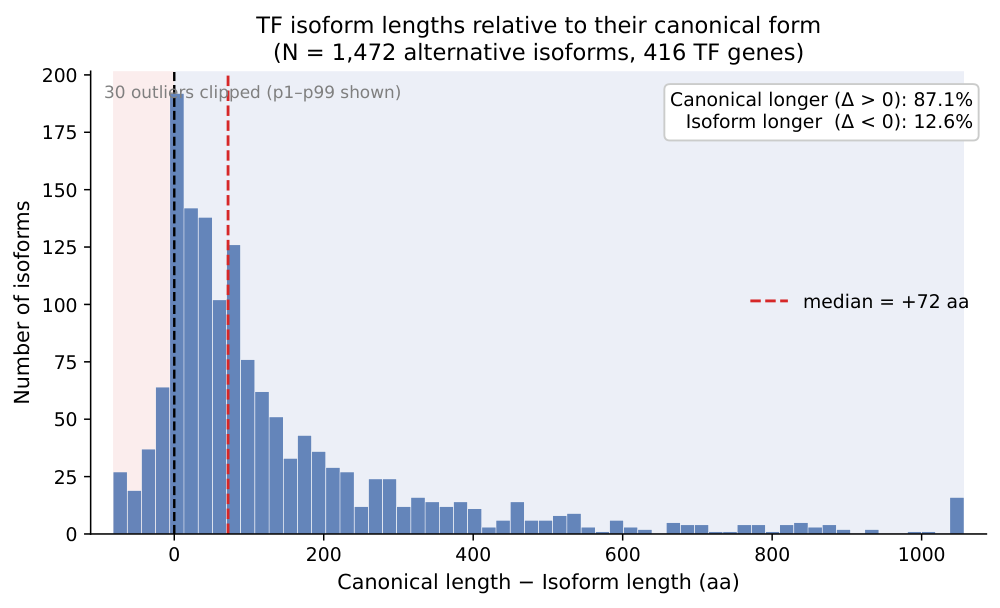</a>

| | |
|---|---|
| File | [`figures/proteome/tf_canonical_vs_isoform_length_delta.pdf`](figures/proteome/tf_canonical_vs_isoform_length_delta.pdf) |
| Shows | The TF panel of C10 as a standalone figure (N=1,472 alternative isoforms, 416 genes; median +72 aa). |
| Statistics | Descriptive. |
| Made by | `scripts/figures/fig4C_5Dalt_length_delta_proteome.py` |
| Notes | RECONSTRUCTION: the original code was lost; every value printed on the original figure is reproduced. Duplicates the left panel of C10. |
| Poster | no |
| Paper | not decided |

### C12

**TF alternative isoforms that lose or gain IDR segments**

<a href="figures/proteome_extended/figH_tf_alt_seg_change.pdf">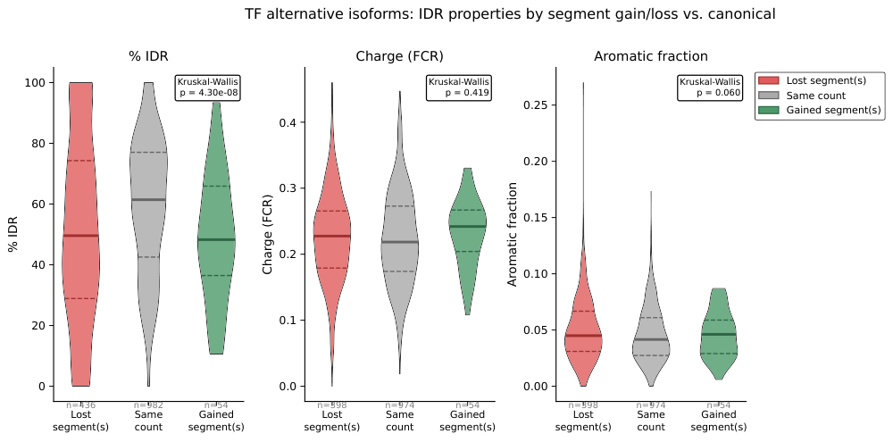</a>

| | |
|---|---|
| File | [`figures/proteome_extended/figH_tf_alt_seg_change.pdf`](figures/proteome_extended/figH_tf_alt_seg_change.pdf) |
| Shows | TF alternative isoforms grouped by IDR segment count relative to canonical (lost / same / gained): %IDR, FCR and aromatic fraction. |
| Statistics | Kruskal-Wallis: %IDR p=4.3e-8, FCR p=0.42, aromatic p=0.060. |
| Made by | `notebooks/05_proteome_analysis_extended` |
| Notes | — |
| Poster | no |
| Paper | not decided |

### C13

**Genes with the largest within-gene %IDR range**

<a href="figures/genomic/fig11_top_idr_rewiring_genes.pdf">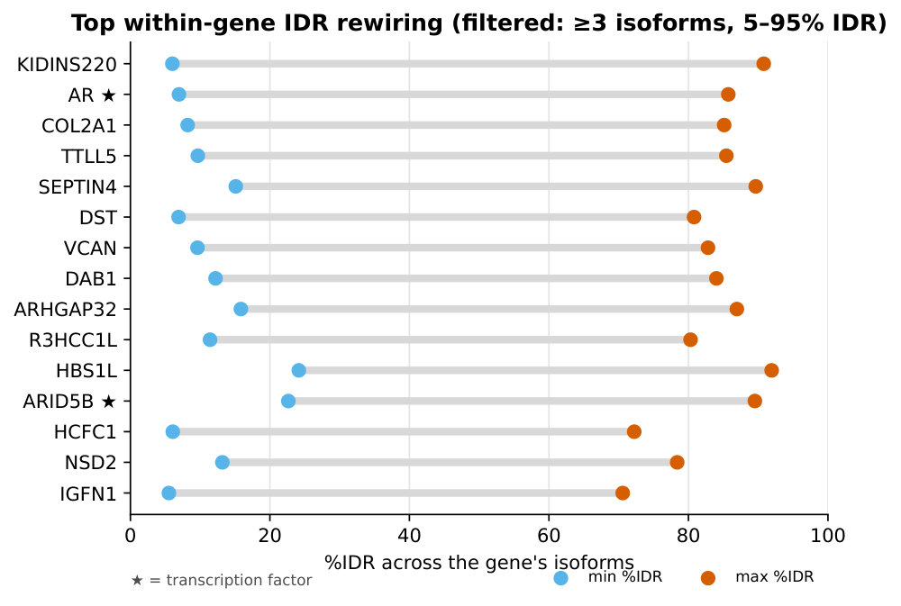</a>

| | |
|---|---|
| File | [`figures/genomic/fig11_top_idr_rewiring_genes.pdf`](figures/genomic/fig11_top_idr_rewiring_genes.pdf) |
| Shows | Top 15 genes by %IDR range among genes with >=3 isoforms whose isoforms all have 5-95% IDR (KIDINS220, AR, COL2A1, ...); TFs starred. |
| Statistics | Descriptive; the 5-95% filter excludes all-or-nothing isoforms. |
| Made by | `scripts/figures/genomic_preliminary_fig01_to_fig12.py` |
| Notes | RECONSTRUCTION: the original code was lost; every value printed on the original figure is reproduced. |
| Poster | no |
| Paper | not decided |

## TF families and protein families

| ID | Figure | Poster | Paper |
|---|---|---|---|
| [D1](#d1) | Isoforms per gene by TF family |  |  |
| [D2](#d2) | IDRs per isoform by TF family |  |  |
| [D3](#d3) | %IDR per isoform by TF family |  |  |
| [D4](#d4) | Within-gene %IDR range by TF family |  |  |
| [D5](#d5) | %IDR per isoform, families ranked by isoforms per gene |  |  |
| [D6](#d6) | IDR profile by TF family (z-scores) |  |  |
| [D7](#d7) | Share of alternative exons encoding an IDR, by TF family |  |  |
| [D8](#d8) | Disorder across UniProt protein families | yes |  |

### D1

**Isoforms per gene by TF family**

<a href="figures/proteome/fig5A_tffamilies_nisoforms.pdf">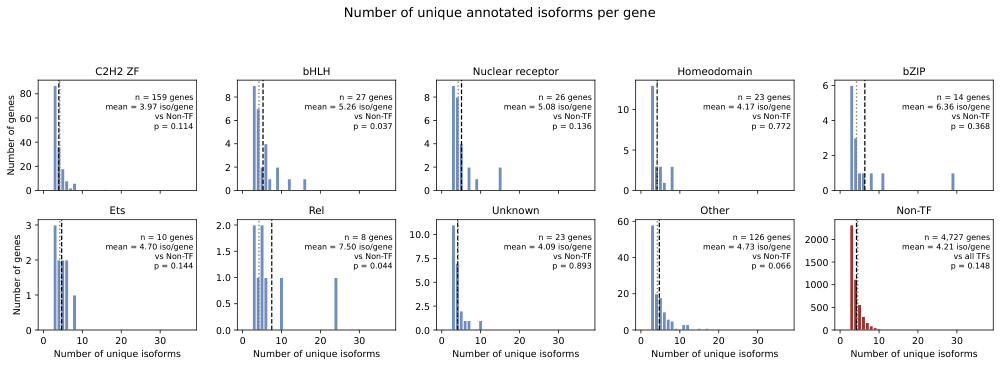</a>

| | |
|---|---|
| File | [`figures/proteome/fig5A_tffamilies_nisoforms.pdf`](figures/proteome/fig5A_tffamilies_nisoforms.pdf) |
| Shows | Histograms for the 7 TF families with most genes (C2H2 ZF, bHLH, nuclear receptor, homeodomain, bZIP, Ets, Rel) plus Unknown, Other and Non-TF. |
| Statistics | MWU of each panel vs Non-TF (about 10 tests, uncorrected). |
| Made by | `notebooks/02_proteome_analysis` |
| Notes | Family ties broken by gene count, isoform count, then name. |
| Poster | no |
| Paper | not decided |

### D2

**IDRs per isoform by TF family**

<a href="figures/proteome/fig5B_tf_families_nidrsegments.pdf">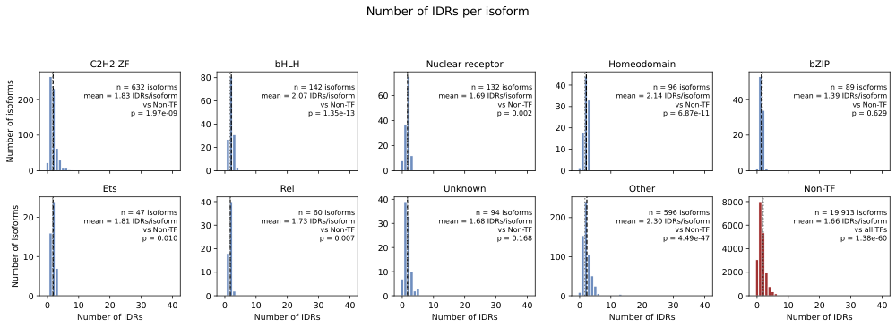</a>

| | |
|---|---|
| File | [`figures/proteome/fig5B_tf_families_nidrsegments.pdf`](figures/proteome/fig5B_tf_families_nidrsegments.pdf) |
| Shows | As D1 for the number of IDR segments per isoform. |
| Statistics | MWU vs Non-TF per panel, uncorrected. |
| Made by | `notebooks/02_proteome_analysis` |
| Notes | — |
| Poster | no |
| Paper | not decided |

### D3

**%IDR per isoform by TF family**

<a href="figures/proteome/fig5C_tf_families_pctidr.pdf">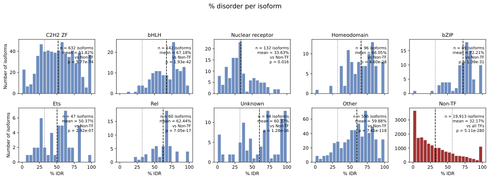</a>

| | |
|---|---|
| File | [`figures/proteome/fig5C_tf_families_pctidr.pdf`](figures/proteome/fig5C_tf_families_pctidr.pdf) |
| Shows | As D1 for %IDR per isoform (e.g. bZIP mean 72%, nuclear receptor 34%, Non-TF 32%). |
| Statistics | MWU vs Non-TF per panel, uncorrected. |
| Made by | `notebooks/02_proteome_analysis` |
| Notes | — |
| Poster | no |
| Paper | not decided |

### D4

**Within-gene %IDR range by TF family**

<a href="figures/proteome/fig5D_tf_families_pctchangeidr.pdf">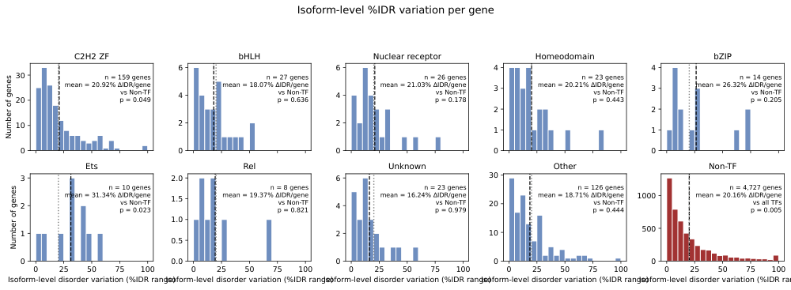</a>

| | |
|---|---|
| File | [`figures/proteome/fig5D_tf_families_pctchangeidr.pdf`](figures/proteome/fig5D_tf_families_pctchangeidr.pdf) |
| Shows | As D1 for the %IDR range per gene. |
| Statistics | MWU vs Non-TF per panel, uncorrected. |
| Made by | `notebooks/02_proteome_analysis` |
| Notes | — |
| Poster | no |
| Paper | not decided |

### D5

**%IDR per isoform, families ranked by isoforms per gene**

<a href="figures/proteome/fig5D_tf_families_pctidr_nisoforms.pdf">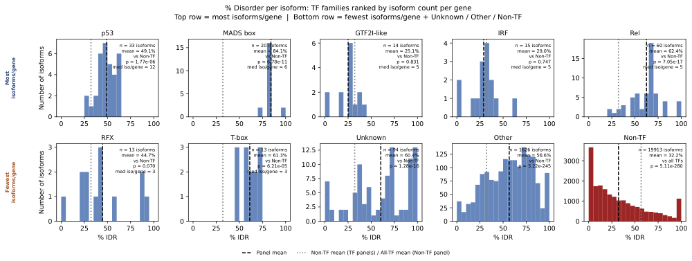</a>

| | |
|---|---|
| File | [`figures/proteome/fig5D_tf_families_pctidr_nisoforms.pdf`](figures/proteome/fig5D_tf_families_pctidr_nisoforms.pdf) |
| Shows | %IDR histograms for the 5 TF families with the most isoforms per gene (p53, MADS box, GTF2I-like, IRF, Rel) and the 2 with the fewest (RFX, T-box), plus Unknown, Other and Non-TF. |
| Statistics | MWU vs Non-TF (Non-TF panel vs all TFs), uncorrected. |
| Made by | `scripts/figures/fig4C_5Dalt_length_delta_proteome.py` |
| Notes | RECONSTRUCTION: the original code was lost; every value printed on the original figure is reproduced. Five families tie at median 5 isoforms/gene; which three appear is decided by sort order, not the data. |
| Poster | no |
| Paper | not decided |

### D6

**IDR profile by TF family (z-scores)**

<a href="figures/proteome_extended/figG_tf_family_idr_heatmap.pdf">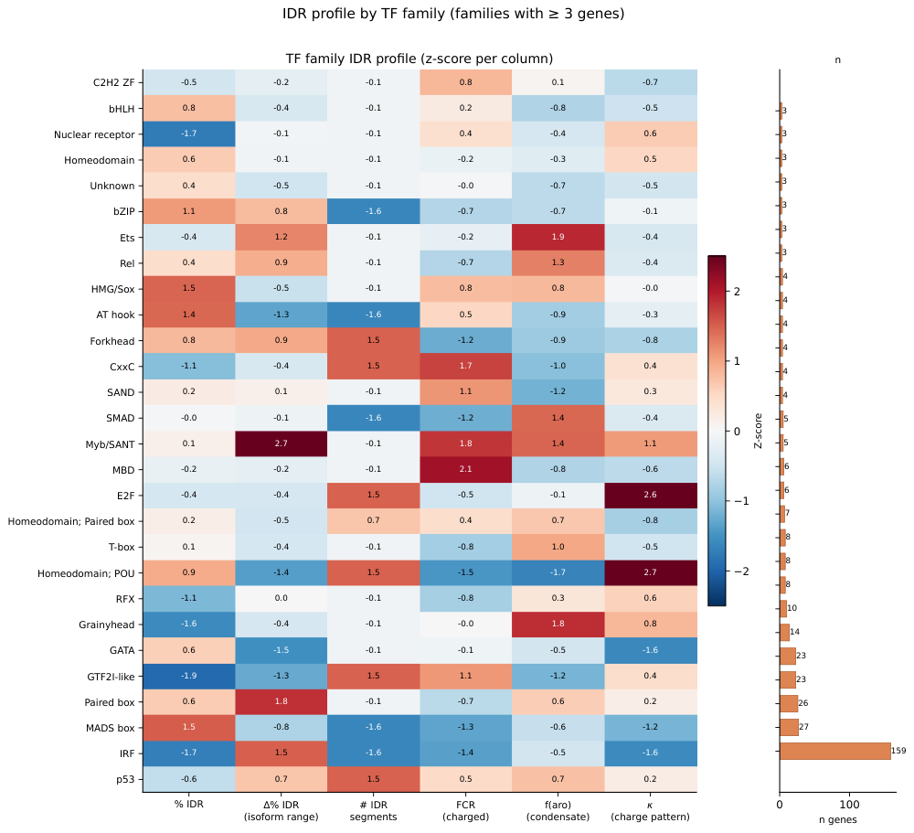</a>

| | |
|---|---|
| File | [`figures/proteome_extended/figG_tf_family_idr_heatmap.pdf`](figures/proteome_extended/figG_tf_family_idr_heatmap.pdf) |
| Shows | TF families with >=3 genes: column z-scores of %IDR, %IDR range, IDR segments, FCR, f(aromatic), kappa; side bars give genes per family. |
| Statistics | Descriptive. |
| Made by | `notebooks/05_proteome_analysis_extended` |
| Notes | KNOWN BUG: the 'n genes' side bars are drawn bottom-up while the heatmap rows run top-down, so the counts are reversed (159, C2H2 ZF's count, sits beside IRF). The heatmap itself is correct. |
| Poster | no |
| Paper | not decided |

### D7

**Share of alternative exons encoding an IDR, by TF family**

<a href="figures/genomic/fig10_tf_family.pdf">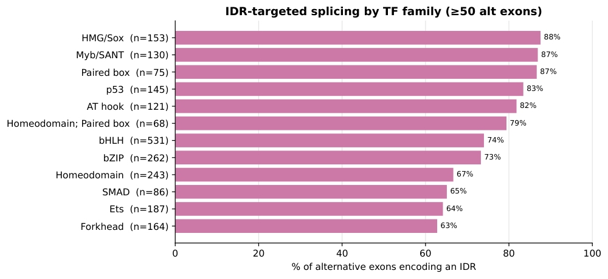</a>

| | |
|---|---|
| File | [`figures/genomic/fig10_tf_family.pdf`](figures/genomic/fig10_tf_family.pdf) |
| Shows | TF families with >=50 alternative exon rows: % encoding an IDR (idr_frac >=0.5); top 12 of 25 shown (HMG/Sox 88% ... Forkhead 63%). |
| Statistics | Descriptive; exons counted once per isoform. |
| Made by | `scripts/figures/genomic_preliminary_fig01_to_fig12.py` |
| Notes | RECONSTRUCTION: the original code was lost; every value printed on the original figure is reproduced. Alternative exon = present in some but not all of the gene's mapped transcripts (exon_usage). Only the 12 highest families are shown (the rest go down to 31%). |
| Poster | no |
| Paper | not decided |

### D8

**Disorder across UniProt protein families**

<a href="figures/proteome/fig_family_disorder.pdf">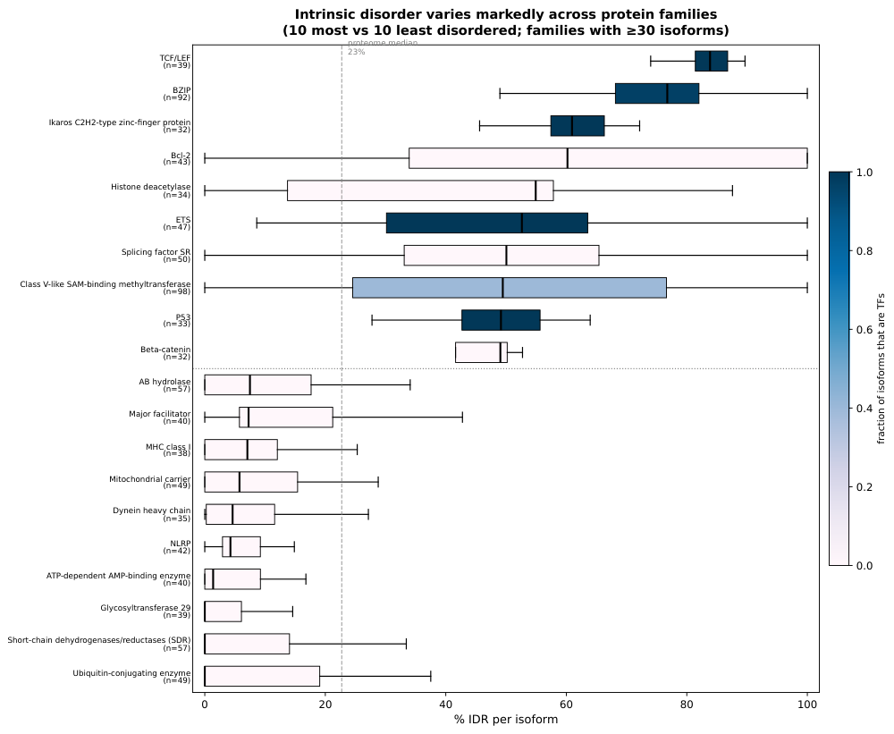</a>

| | |
|---|---|
| File | [`figures/proteome/fig_family_disorder.pdf`](figures/proteome/fig_family_disorder.pdf) |
| Shows | %IDR per isoform for the 10 most and 10 least disordered UniProt protein families with >=30 isoforms; colour = fraction of isoforms that are TFs. |
| Statistics | Descriptive. |
| Made by | `scripts/figures/fig_family_disorder.py` |
| Notes | Recovered script; table in results/tables/family_disorder_table.csv. |
| Poster | yes |
| Paper | not decided |

## Gene age

| ID | Figure | Poster | Paper |
|---|---|---|---|
| [E1](#e1) | %IDR by gene age, TF vs non-TF | yes |  |
| [E2](#e2) | %IDR by gene age (p-value box) |  |  |
| [E3](#e3) | Isoforms per gene by gene age |  |  |
| [E4](#e4) | Canonical %IDR by gene age, TF and non-TF |  |  |
| [E5](#e5) | Gene age vs canonical %IDR |  |  |
| [E6](#e6) | Gene age vs isoform count |  |  |
| [E7](#e7) | Gene age vs within-gene %IDR range |  |  |
| [E8](#e8) | TF families ranked by median gene age |  |  |
| [E9](#e9) | IDR properties by gene age (canonical) |  |  |
| [E10](#e10) | IDR properties by gene age: z-scores by group |  |  |
| [E11](#e11) | IDR properties by gene age: medians by group |  |  |
| [E12](#e12) | Longest IDR segment vs gene age | yes |  |
| [E13](#e13) | % with >=1 IDR by gene age |  |  |
| [E14](#e14) | IDR-encoding alternative exons by gene age |  |  |
| [E15](#e15) | Fate of IDR exons by gene age | yes |  |
| [E16](#e16) | Alternative-exon IDR fraction by gene age | yes |  |

### E1

**%IDR by gene age, TF vs non-TF**

<a href="figures/proteome/fig4A_geneage_pct_idr_stars.pdf">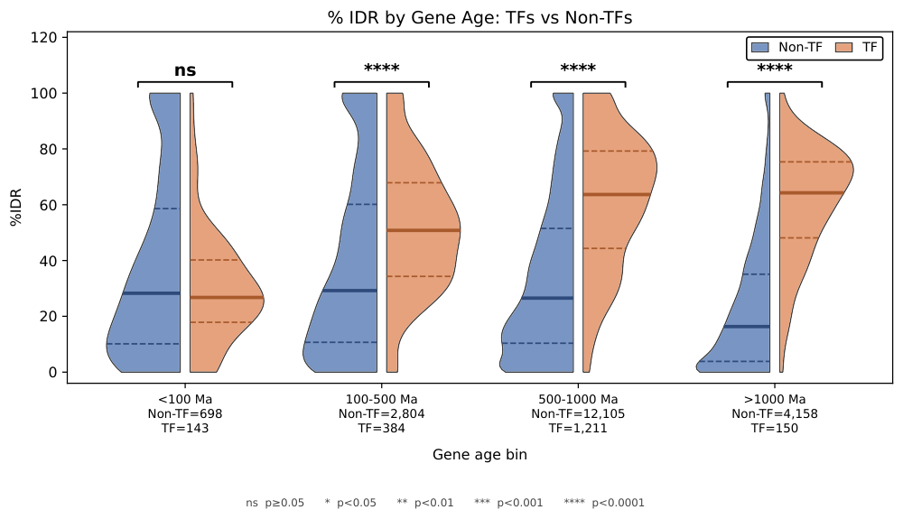</a>

| | |
|---|---|
| File | [`figures/proteome/fig4A_geneage_pct_idr_stars.pdf`](figures/proteome/fig4A_geneage_pct_idr_stars.pdf) |
| Shows | Split violins of %IDR per isoform by GenOrigin age bin (<100, 100-500, 500-1000, >1000 Ma), TF vs non-TF. |
| Statistics | MWU per bin as stars (ns, ****, ****, ****); 4 uncorrected tests. |
| Made by | `scripts/figures/fig4A_gene_age_pct_idr_stars.py` |
| Notes | Recovered script. Poster version of E2. |
| Poster | yes |
| Paper | not decided |

### E2

**%IDR by gene age (p-value box)**

<a href="figures/proteome/fig4A_geneage_pct_idr.pdf">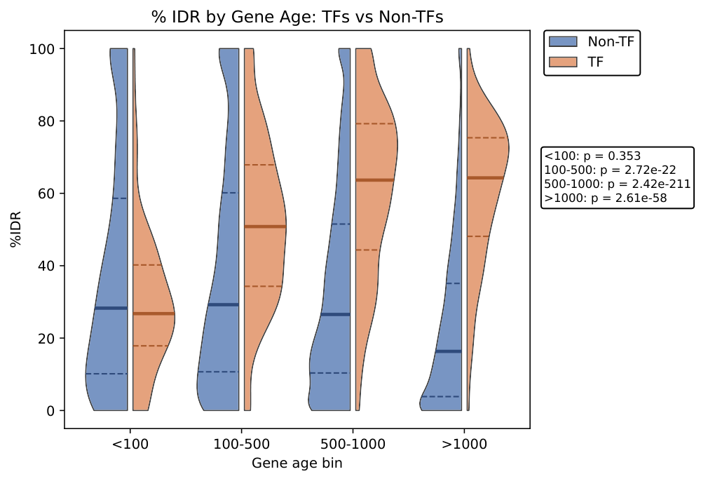</a>

| | |
|---|---|
| File | [`figures/proteome/fig4A_geneage_pct_idr.pdf`](figures/proteome/fig4A_geneage_pct_idr.pdf) |
| Shows | As E1 with p-values in a text box. |
| Statistics | MWU per bin: 0.35, 2.7e-22, 2.4e-211, 2.6e-58. |
| Made by | `notebooks/02_proteome_analysis` |
| Notes | Earlier version of E1. |
| Poster | no |
| Paper | not decided |

### E3

**Isoforms per gene by gene age**

<a href="figures/proteome/fig4B_geneage_nisoforms.pdf">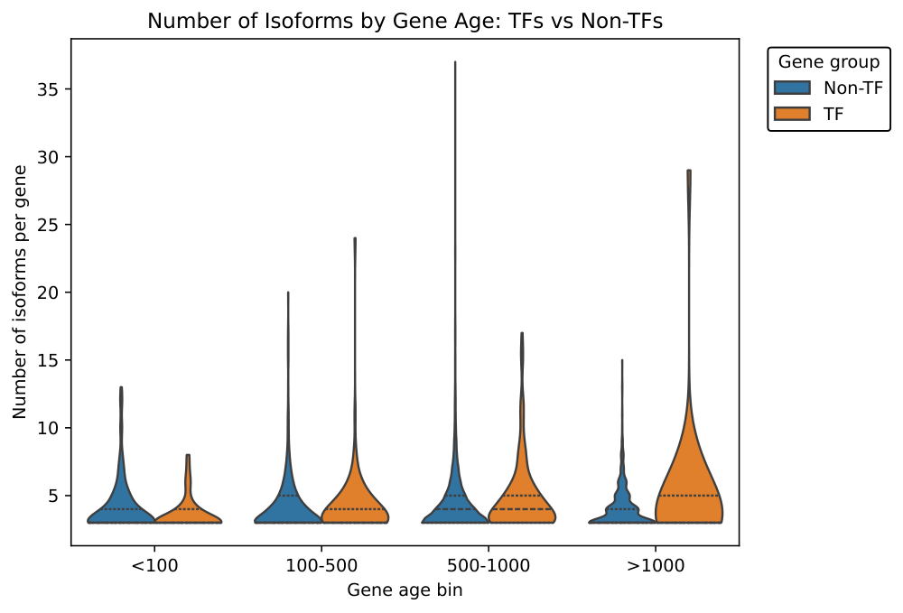</a>

| | |
|---|---|
| File | [`figures/proteome/fig4B_geneage_nisoforms.pdf`](figures/proteome/fig4B_geneage_nisoforms.pdf) |
| Shows | Violins of isoforms per gene by age bin, TF vs non-TF. |
| Statistics | Descriptive. |
| Made by | `notebooks/02_proteome_analysis` |
| Notes | — |
| Poster | no |
| Paper | not decided |

### E4

**Canonical %IDR by gene age, TF and non-TF**

<a href="figures/proteome/fig4C_geneage_pctchangeidr.pdf">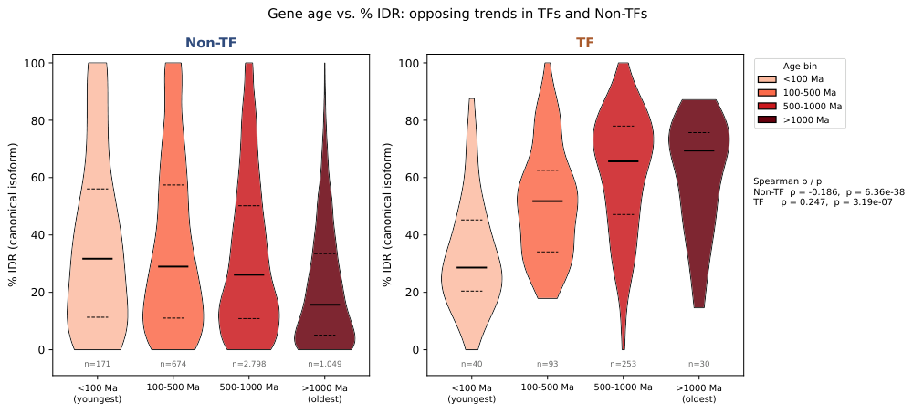</a>

| | |
|---|---|
| File | [`figures/proteome/fig4C_geneage_pctchangeidr.pdf`](figures/proteome/fig4C_geneage_pctchangeidr.pdf) |
| Shows | Canonical isoforms: %IDR by age bin, non-TF and TF panels (the file name says pct change, but the metric is %IDR). |
| Statistics | Spearman vs gene age: non-TF rho=-0.186 (p=6.4e-38); TF rho=0.247 (p=3.2e-7). |
| Made by | `scripts/figures/fig4C_5Dalt_length_delta_proteome.py` |
| Notes | RECONSTRUCTION: the original code was lost; every value printed on the original figure is reproduced. Same data and statistics as E5. |
| Poster | no |
| Paper | not decided |

### E5

**Gene age vs canonical %IDR**

<a href="figures/proteome_extended/fig_age1_pct_idr_vs_age.pdf">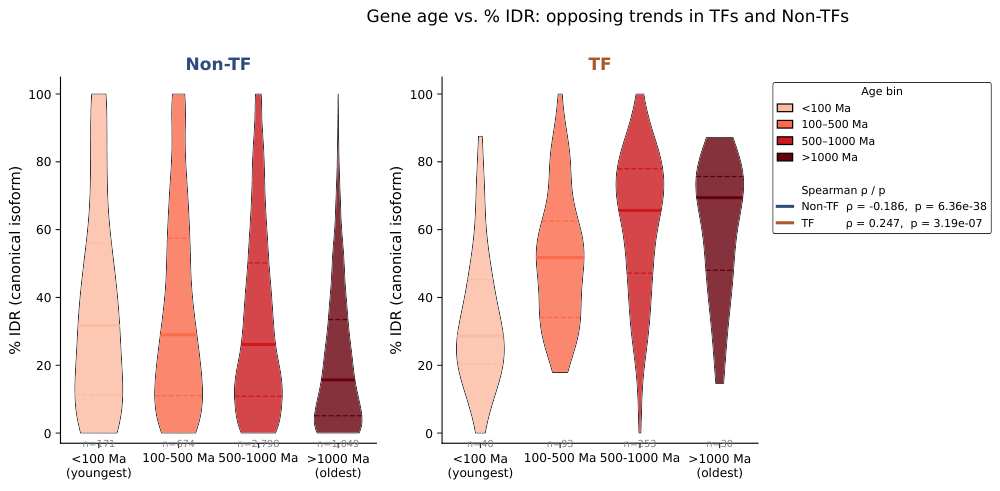</a>

| | |
|---|---|
| File | [`figures/proteome_extended/fig_age1_pct_idr_vs_age.pdf`](figures/proteome_extended/fig_age1_pct_idr_vs_age.pdf) |
| Shows | As E4 (canonical %IDR by age bin, non-TF and TF). |
| Statistics | Spearman: non-TF rho=-0.186; TF rho=0.247. |
| Made by | `notebooks/05_proteome_analysis_extended` |
| Notes | Duplicate of E4. |
| Poster | no |
| Paper | not decided |

### E6

**Gene age vs isoform count**

<a href="figures/proteome_extended/fig_age2_n_isoforms_vs_age.pdf">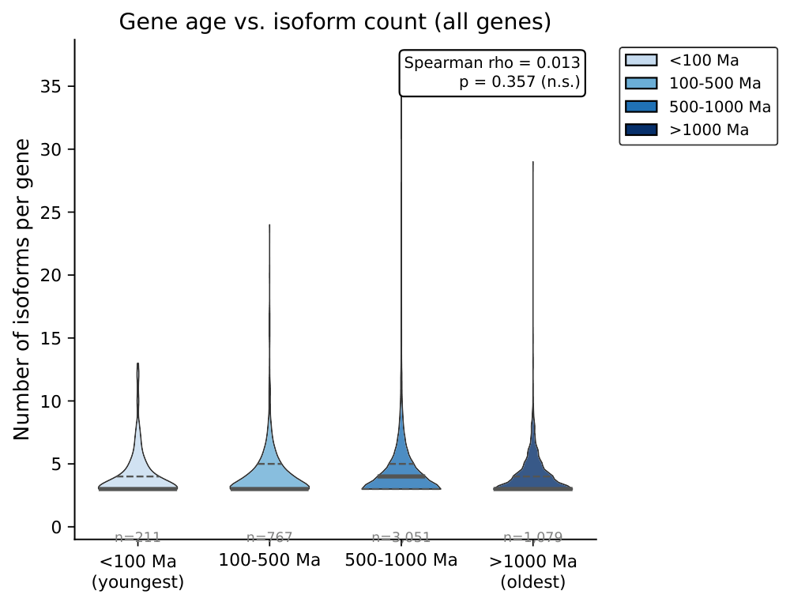</a>

| | |
|---|---|
| File | [`figures/proteome_extended/fig_age2_n_isoforms_vs_age.pdf`](figures/proteome_extended/fig_age2_n_isoforms_vs_age.pdf) |
| Shows | Isoforms per gene by age bin, all genes. |
| Statistics | Spearman rho=0.013, p=0.36. |
| Made by | `notebooks/05_proteome_analysis_extended` |
| Notes | Overlaps E3. |
| Poster | no |
| Paper | not decided |

### E7

**Gene age vs within-gene %IDR range**

<a href="figures/proteome_extended/fig_age3_pct_change_idr_vs_age.pdf">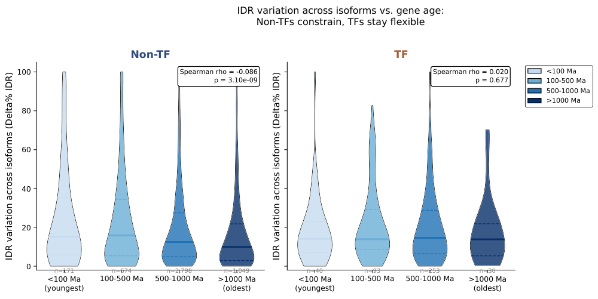</a>

| | |
|---|---|
| File | [`figures/proteome_extended/fig_age3_pct_change_idr_vs_age.pdf`](figures/proteome_extended/fig_age3_pct_change_idr_vs_age.pdf) |
| Shows | %IDR range per gene by age bin, non-TF and TF. |
| Statistics | Spearman: non-TF rho=-0.086 (p=3.1e-9); TF rho=0.020 (p=0.68). |
| Made by | `notebooks/05_proteome_analysis_extended` |
| Notes | — |
| Poster | no |
| Paper | not decided |

### E8

**TF families ranked by median gene age**

<a href="figures/proteome_extended/fig_age4_tf_families_by_age.pdf">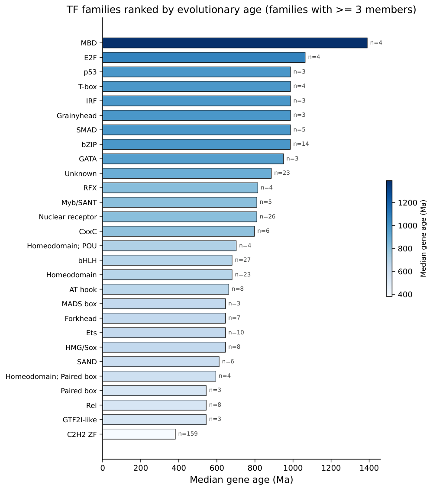</a>

| | |
|---|---|
| File | [`figures/proteome_extended/fig_age4_tf_families_by_age.pdf`](figures/proteome_extended/fig_age4_tf_families_by_age.pdf) |
| Shows | Median GenOrigin age of TF families with >=3 member genes. |
| Statistics | Descriptive. |
| Made by | `notebooks/05_proteome_analysis_extended` |
| Notes | — |
| Poster | no |
| Paper | not decided |

### E9

**IDR properties by gene age (canonical)**

<a href="figures/proteome_extended/fig_age5_idr_biophysics_heatmap.pdf">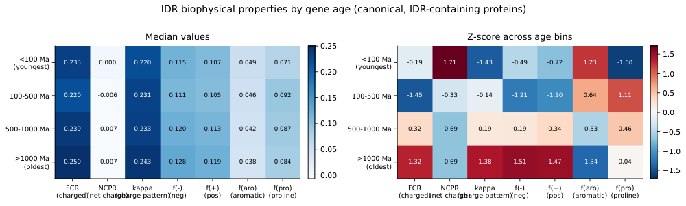</a>

| | |
|---|---|
| File | [`figures/proteome_extended/fig_age5_idr_biophysics_heatmap.pdf`](figures/proteome_extended/fig_age5_idr_biophysics_heatmap.pdf) |
| Shows | Canonical IDR-containing proteins: median FCR, NCPR, kappa, f(-), f(+), f(aromatic), f(proline) per age bin, and z-scores across bins. |
| Statistics | Descriptive. |
| Made by | `notebooks/05_proteome_analysis_extended` |
| Notes | — |
| Poster | no |
| Paper | not decided |

### E10

**IDR properties by gene age: z-scores by group**

<a href="figures/proteome_extended/fig_age5b_idr_biophysics_heatmap_canon_alt_tf_nontf.pdf">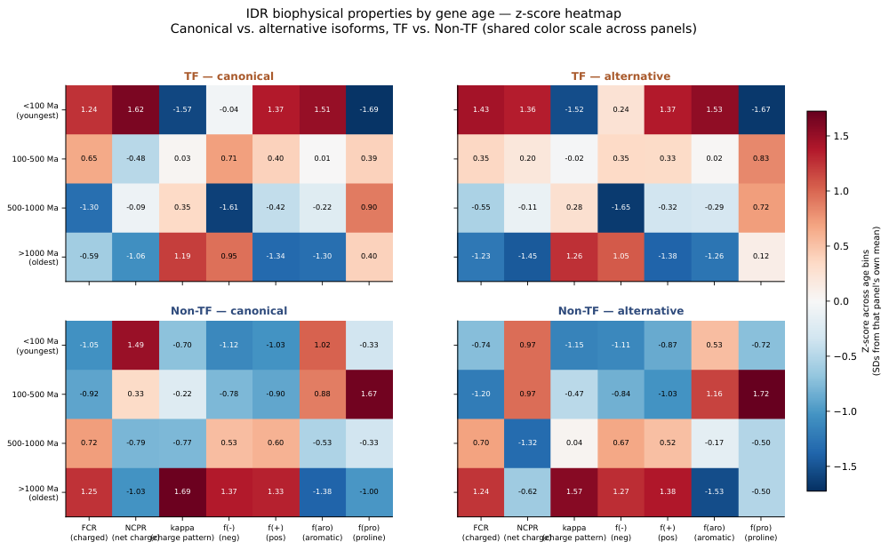</a>

| | |
|---|---|
| File | [`figures/proteome_extended/fig_age5b_idr_biophysics_heatmap_canon_alt_tf_nontf.pdf`](figures/proteome_extended/fig_age5b_idr_biophysics_heatmap_canon_alt_tf_nontf.pdf) |
| Shows | As E9 z-scores, split TF/non-TF x canonical/alternative. |
| Statistics | Descriptive. |
| Made by | `notebooks/05_proteome_analysis_extended` |
| Notes | — |
| Poster | no |
| Paper | not decided |

### E11

**IDR properties by gene age: medians by group**

<a href="figures/proteome_extended/fig_age5c_idr_biophysics_median_heatmap_canon_alt_tf_nontf.pdf">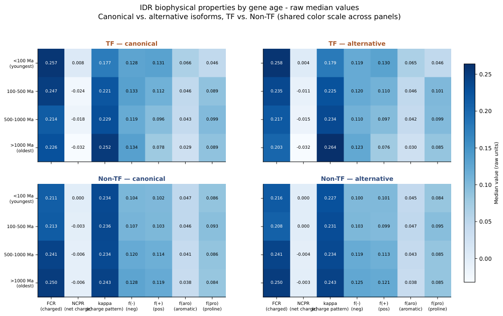</a>

| | |
|---|---|
| File | [`figures/proteome_extended/fig_age5c_idr_biophysics_median_heatmap_canon_alt_tf_nontf.pdf`](figures/proteome_extended/fig_age5c_idr_biophysics_median_heatmap_canon_alt_tf_nontf.pdf) |
| Shows | As E10 with raw medians on a shared colour scale. |
| Statistics | Descriptive. |
| Made by | `notebooks/05_proteome_analysis_extended` |
| Notes | — |
| Poster | no |
| Paper | not decided |

### E12

**Longest IDR segment vs gene age**

<a href="figures/proteome_extended/fig_age6_max_idr_len_vs_age.pdf">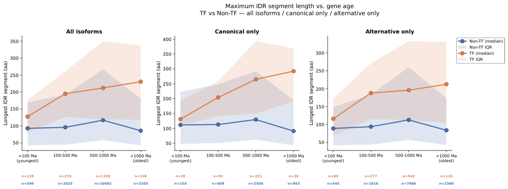</a>

| | |
|---|---|
| File | [`figures/proteome_extended/fig_age6_max_idr_len_vs_age.pdf`](figures/proteome_extended/fig_age6_max_idr_len_vs_age.pdf) |
| Shows | Median and IQR of the longest IDR per isoform by age bin, TF vs non-TF, for all / canonical / alternative isoforms. |
| Statistics | Descriptive. |
| Made by | `notebooks/05_proteome_analysis_extended` |
| Notes | The poster used an earlier render of this figure. |
| Poster | yes |
| Paper | not decided |

### E13

**% with >=1 IDR by gene age**

<a href="figures/proteome_extended/fig_age7_pct_genes_with_idr.pdf">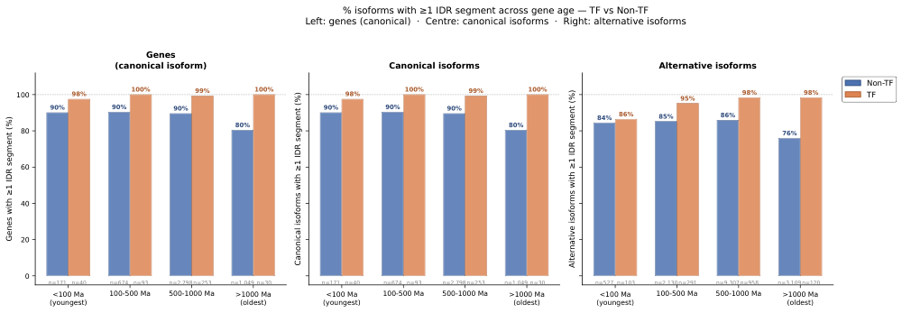=1 IDR by gene age"></a>

| | |
|---|---|
| File | [`figures/proteome_extended/fig_age7_pct_genes_with_idr.pdf`](figures/proteome_extended/fig_age7_pct_genes_with_idr.pdf) |
| Shows | % of genes (canonical), canonical isoforms and alternative isoforms with >=1 IDR, by age bin, TF vs non-TF. |
| Statistics | Descriptive. |
| Made by | `notebooks/05_proteome_analysis_extended` |
| Notes | — |
| Poster | no |
| Paper | not decided |

### E14

**IDR-encoding alternative exons by gene age**

<a href="figures/genomic/fig09_gene_age.pdf">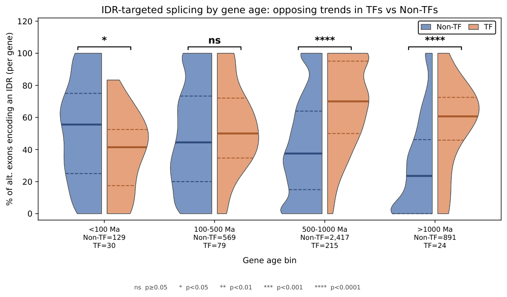</a>

| | |
|---|---|
| File | [`figures/genomic/fig09_gene_age.pdf`](figures/genomic/fig09_gene_age.pdf) |
| Shows | Per gene (>=3 alternative exon rows): % of alternative exons encoding an IDR, by age bin, TF vs non-TF (genes: 129+30, 569+79, 2,417+215, 891+24). |
| Statistics | MWU per bin as stars (*, ns, ****, ****); uncorrected. |
| Made by | `scripts/figures/fig09_gene_age.py` |
| Notes | Recovered script. Alternative exon = present in some but not all of the gene's mapped transcripts (exon_usage). With the older GENCODE-wide definition the 100-500 Ma bin was ****. |
| Poster | no |
| Paper | not decided |

### E15

**Fate of IDR exons by gene age**

<a href="figures/genomic/fig15b_idr_fate_by_age.pdf">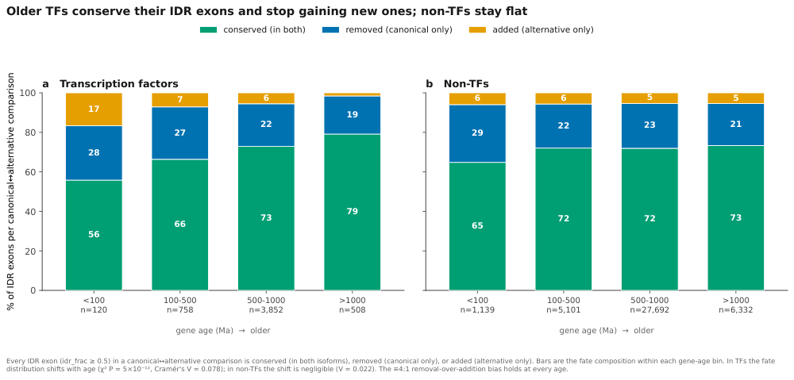</a>

| | |
|---|---|
| File | [`figures/genomic/fig15b_idr_fate_by_age.pdf`](figures/genomic/fig15b_idr_fate_by_age.pdf) |
| Shows | Share of IDR exons conserved / removed / added per canonical-alternative comparison, by age bin, TF and non-TF panels. |
| Statistics | chi-square per group across age bins (TF P=5e-12, Cramer's V=0.078; non-TF V=0.022). |
| Made by | `scripts/figures/fig15b_idr_fate_by_age.py` |
| Notes | Recovered script; table in results/tables/fig15b_idr_exon_fate_by_pair.csv. 'Removed' is relative to the canonical isoform, not evolutionary loss. |
| Poster | yes |
| Paper | not decided |

### E16

**Alternative-exon IDR fraction by gene age**

<a href="figures/genomic/fig16b_idrfrac_by_age.pdf">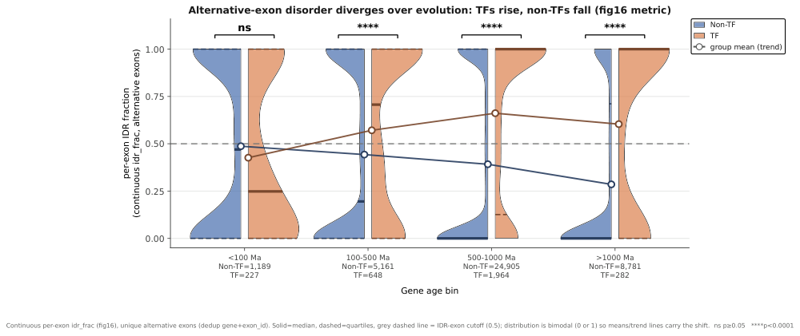</a>

| | |
|---|---|
| File | [`figures/genomic/fig16b_idrfrac_by_age.pdf`](figures/genomic/fig16b_idrfrac_by_age.pdf) |
| Shows | Unique alternative exons (gene + exon ID): per-exon IDR fraction by age bin, TF vs non-TF, with group means. |
| Statistics | MWU per bin as stars (ns, ****, ****, ****); uncorrected. |
| Made by | `scripts/figures/fig16b_idrfrac_by_age.py` |
| Notes | Recovered script. Alternative exon = present in some but not all of the gene's mapped transcripts (exon_usage). |
| Poster | yes |
| Paper | not decided |

## Where IDRs sit in proteins and exons

| ID | Figure | Poster | Paper |
|---|---|---|---|
| [F1](#f1) | IDR density along the protein and along the exon | yes |  |
| [F2](#f2) | IDR position along the protein (thirds) |  |  |
| [F3](#f3) | Exons spanned per IDR vs ordered segment | yes |  |
| [F4](#f4) | Frame symmetry of exon classes |  |  |
| [F5](#f5) | Length-matched exon density: IDR vs non-IDR (TF transcripts) |  |  |
| [F6](#f6) | Length-matched exon density: TF vs non-TF |  |  |
| [F7](#f7) | Length-matched exon density: IDR regions, TF vs non-TF |  |  |

### F1

**IDR density along the protein and along the exon**

<a href="figures/proteome/fig_idr_position_protein_exon.pdf">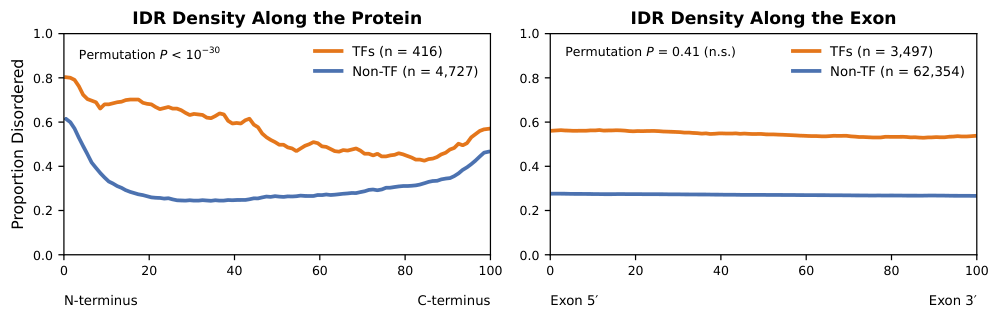</a>

| | |
|---|---|
| File | [`figures/proteome/fig_idr_position_protein_exon.pdf`](figures/proteome/fig_idr_position_protein_exon.pdf) |
| Shows | Proportion disordered along normalised position: canonical proteins (TF 416, non-TF 4,727) and coding exons (TF 3,497, non-TF 62,354). |
| Statistics | Circular-shift permutation test, N=200 (seeds 0/1); the printed 'P < 10^-30' comes from a normal approximation to a z-score. |
| Made by | `scripts/figures/fig_idr_position_protein_exon.py` |
| Notes | Recovered script. With 200 permutations an empirical p cannot go below ~0.005; report as z-based or p <= 0.005. |
| Poster | yes |
| Paper | not decided |

### F2

**IDR position along the protein (thirds)**

<a href="figures/genomic/fig04_idr_position.pdf">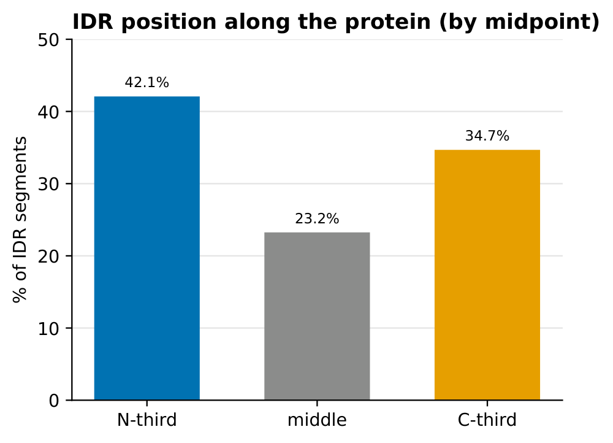</a>

| | |
|---|---|
| File | [`figures/genomic/fig04_idr_position.pdf`](figures/genomic/fig04_idr_position.pdf) |
| Shows | IDR segments of MAIN isoforms by midpoint: N-terminal third 42.1%, middle 23.2%, C-terminal third 34.7%. |
| Statistics | Descriptive. |
| Made by | `scripts/figures/genomic_preliminary_fig01_to_fig12.py` |
| Notes | RECONSTRUCTION: the original code was lost; every value printed on the original figure is reproduced. |
| Poster | no |
| Paper | not decided |

### F3

**Exons spanned per IDR vs ordered segment**

<a href="figures/genomic/fig03_idr_modularity.pdf">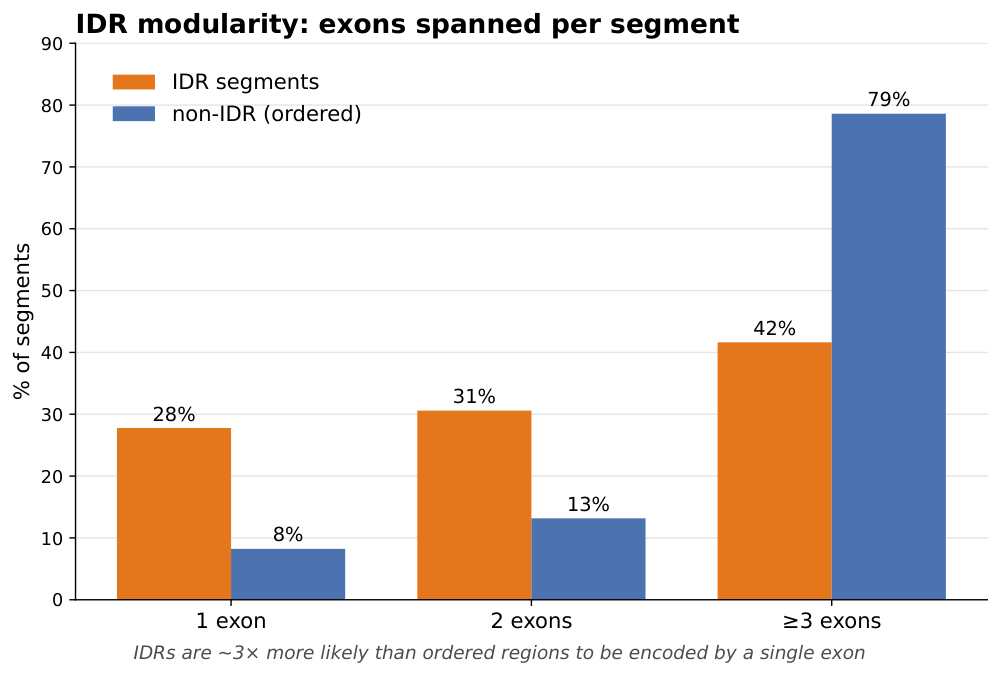</a>

| | |
|---|---|
| File | [`figures/genomic/fig03_idr_modularity.pdf`](figures/genomic/fig03_idr_modularity.pdf) |
| Shows | % of IDR and non-IDR segments spanning 1, 2 or >=3 exons (IDR 28/31/42%; ordered 8/13/79%). |
| Statistics | Descriptive; caption: IDRs ~3x more likely than ordered regions to lie within one exon. |
| Made by | `scripts/figures/fig03_idr_modularity.py` |
| Notes | Recovered script. Not length-matched: the median IDR segment is 69 aa and the median ordered segment 191 aa, and longer segments span more exons. |
| Poster | yes |
| Paper | not decided |

### F4

**Frame symmetry of exon classes**

<a href="figures/genomic/fig07_frame_symmetry.pdf">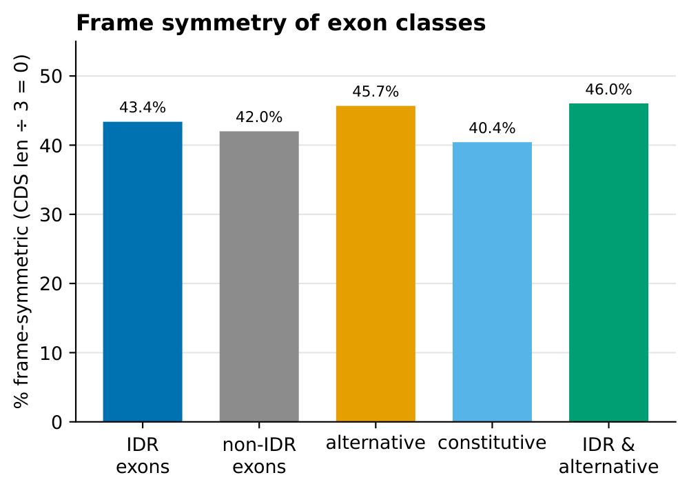</a>

| | |
|---|---|
| File | [`figures/genomic/fig07_frame_symmetry.pdf`](figures/genomic/fig07_frame_symmetry.pdf) |
| Shows | % of coding exon rows whose CDS length is divisible by 3: IDR 43.4%, non-IDR 42.0%, alternative 45.7%, constitutive 40.4%, IDR & alternative 46.0% (random 33%). |
| Statistics | Descriptive, no test. |
| Made by | `scripts/figures/genomic_preliminary_fig01_to_fig12.py` |
| Notes | RECONSTRUCTION: the original code was lost; every value printed on the original figure is reproduced. Alternative exon = present in some but not all of the gene's mapped transcripts (exon_usage). |
| Poster | no |
| Paper | not decided |

### F5

**Length-matched exon density: IDR vs non-IDR (TF transcripts)**

<a href="figures/exon_density/fig_length_matched_idr_density.pdf">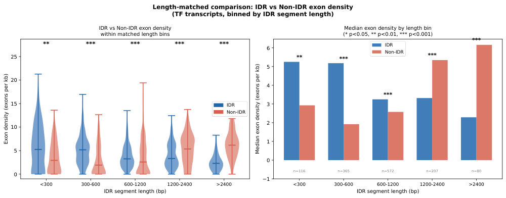</a>

| | |
|---|---|
| File | [`figures/exon_density/fig_length_matched_idr_density.pdf`](figures/exon_density/fig_length_matched_idr_density.pdf) |
| Shows | RefSeq TF transcripts: exon density ((exon pieces - 1) per kb) of IDR vs non-IDR regions within IDR-length bins. |
| Statistics | MWU per bin (5 tests), stars. |
| Made by | `notebooks/06_exon_density_length_matched (cell 28)` |
| Notes | Susie Song's RefSeq-based pipeline and IDR calls (data/raw/exon_density), not the UniProt cohort. |
| Poster | no |
| Paper | not decided |

### F6

**Length-matched exon density: TF vs non-TF**

<a href="figures/exon_density/fig_length_matched_tf_vs_nontf.pdf">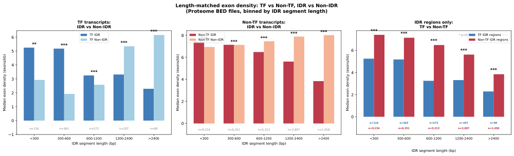</a>

| | |
|---|---|
| File | [`figures/exon_density/fig_length_matched_tf_vs_nontf.pdf`](figures/exon_density/fig_length_matched_tf_vs_nontf.pdf) |
| Shows | Proteome-wide RefSeq transcripts: TF IDR vs non-IDR; non-TF IDR vs non-IDR; IDR regions TF vs non-TF, per IDR-length bin. |
| Statistics | MWU per bin (15 tests), stars. |
| Made by | `notebooks/06_exon_density_length_matched (cell 31)` |
| Notes | As F5. |
| Poster | no |
| Paper | not decided |

### F7

**Length-matched exon density: IDR regions, TF vs non-TF**

<a href="figures/exon_density/fig_length_matched_tf_vs_nontf_idr_only.pdf">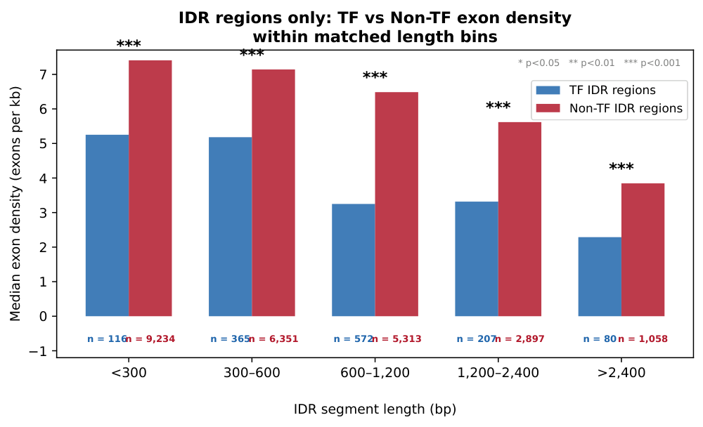</a>

| | |
|---|---|
| File | [`figures/exon_density/fig_length_matched_tf_vs_nontf_idr_only.pdf`](figures/exon_density/fig_length_matched_tf_vs_nontf_idr_only.pdf) |
| Shows | Panel 3 of F6 as a standalone figure: median exon density of TF vs non-TF IDR regions per IDR-length bin, with n. |
| Statistics | MWU per bin, stars. |
| Made by | `scripts/figures/fig_length_matched_tf_vs_nontf_idr_only.py` |
| Notes | RECONSTRUCTION: the original code was lost; every value printed on the original figure is reproduced. As F5. |
| Poster | no |
| Paper | not decided |

## Alternative splicing and IDRs

| ID | Figure | Poster | Paper |
|---|---|---|---|
| [G1](#g1) | IDRs are enriched in alternative exons | yes |  |
| [G2](#g2) | Alternative exons preferentially encode IDRs |  |  |
| [G3](#g3) | Continuous IDR fraction of alternative vs constitutive exons | yes |  |
| [G4](#g4) | Per gene, alternative exons are more disordered |  |  |
| [G5](#g5) | TF genes have a larger share of alternative exons | yes |  |
| [G6](#g6) | As G5, panel A only | yes |  |
| [G7](#g7) | Splicing and IDRs in TFs vs non-TFs: four panels |  |  |
| [G8](#g8) | TF exons encode more disorder per exon |  |  |
| [G9](#g9) | Splicing modulates IDRs: mechanism summary |  |  |
| [G10](#g10) | Splice-event types and their IDR consequence |  |  |
| [G11](#g11) | IDR exons conserved, removed or added (all / TF / non-TF) |  |  |
| [G12](#g12) | As G11, TF and non-TF only | yes |  |
| [G13](#g13) | Aromatic and charged residues of added vs removed IDR exons |  |  |

### G1

**IDRs are enriched in alternative exons**

<a href="figures/genomic/fig14_idr_enrichment_contingency.pdf">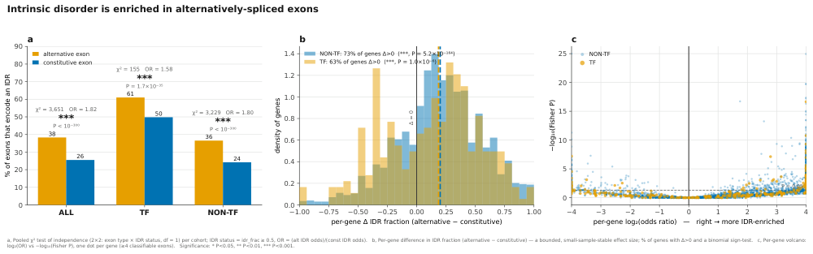</a>

| | |
|---|---|
| File | [`figures/genomic/fig14_idr_enrichment_contingency.pdf`](figures/genomic/fig14_idr_enrichment_contingency.pdf) |
| Shows | a: % of exons encoding an IDR, alternative vs constitutive, all / TF / non-TF (38 vs 26%, 61 vs 50%, 36 vs 24%); b: per-gene difference in IDR fraction; c: per-gene Fisher volcano. |
| Statistics | Pooled chi-square 2x2 with odds ratio per cohort; per-gene sign test and Fisher tests. |
| Made by | `pipeline/tfidr_pipeline/stages/s9b_idr_enrichment.py` |
| Notes | Alternative exon = present in some but not all of the gene's mapped transcripts (exon_usage). |
| Poster | yes |
| Paper | not decided |

### G2

**Alternative exons preferentially encode IDRs**

<a href="figures/genomic/fig06_alt_vs_constitutive.pdf">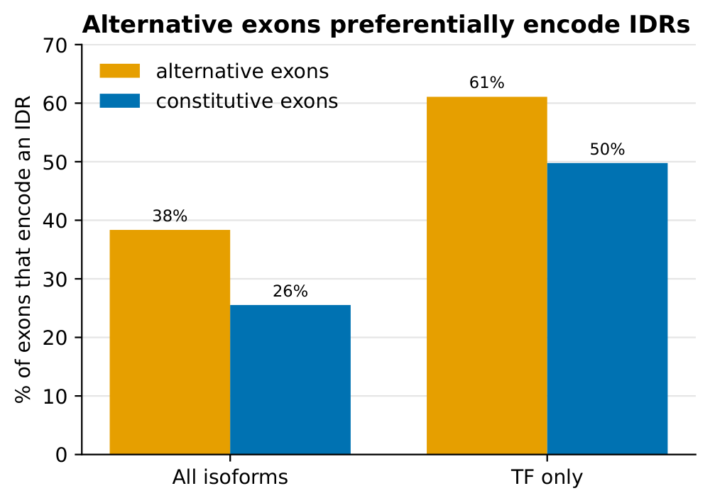</a>

| | |
|---|---|
| File | [`figures/genomic/fig06_alt_vs_constitutive.pdf`](figures/genomic/fig06_alt_vs_constitutive.pdf) |
| Shows | % of coding exon rows encoding an IDR, alternative vs constitutive: all isoforms 38% vs 26%; TF 61% vs 50%. |
| Statistics | Descriptive; exons counted once per isoform. |
| Made by | `scripts/figures/genomic_preliminary_fig01_to_fig12.py` |
| Notes | RECONSTRUCTION: the original code was lost; every value printed on the original figure is reproduced. Alternative exon = present in some but not all of the gene's mapped transcripts (exon_usage). Same comparison as G1 panel a. |
| Poster | no |
| Paper | not decided |

### G3

**Continuous IDR fraction of alternative vs constitutive exons**

<a href="figures/genomic/fig16_exon_idr_fraction_continuous.pdf">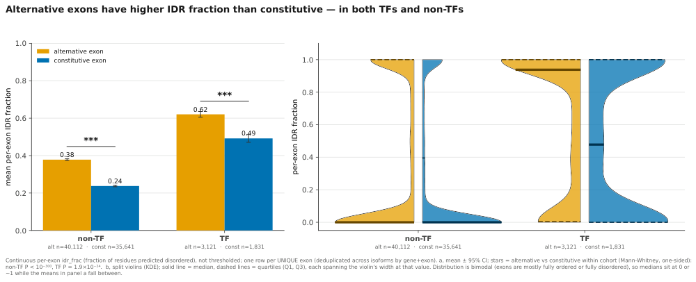</a>

| | |
|---|---|
| File | [`figures/genomic/fig16_exon_idr_fraction_continuous.pdf`](figures/genomic/fig16_exon_idr_fraction_continuous.pdf) |
| Shows | Unique exons: mean (95% CI) and split violins of per-exon IDR fraction; non-TF 0.38 vs 0.24 (40,112 / 35,641 exons), TF 0.62 vs 0.49 (3,121 / 1,831). |
| Statistics | One-sided MWU within cohort (non-TF P<1e-300, TF P=1.9e-24). |
| Made by | `pipeline/tfidr_pipeline/stages/s9c_exon_idr_fraction.py` |
| Notes | Alternative exon = present in some but not all of the gene's mapped transcripts (exon_usage). |
| Poster | yes |
| Paper | not decided |

### G4

**Per gene, alternative exons are more disordered**

<a href="figures/genomic/fig17_gene_idr_fraction.pdf">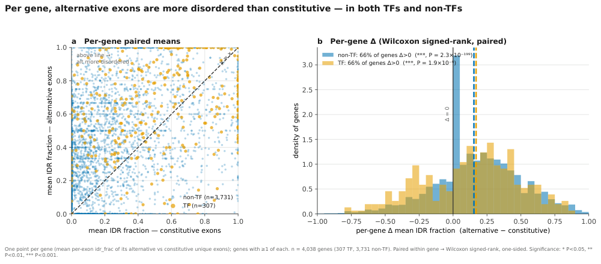</a>

| | |
|---|---|
| File | [`figures/genomic/fig17_gene_idr_fraction.pdf`](figures/genomic/fig17_gene_idr_fraction.pdf) |
| Shows | One point per gene with both exon classes (4,038 genes: 307 TF, 3,731 non-TF): mean IDR fraction of alternative vs constitutive exons; 66% of genes have a positive difference in both groups. |
| Statistics | One-sided Wilcoxon signed-rank per cohort (non-TF P=2.3e-199, TF P=1.9e-9). |
| Made by | `pipeline/tfidr_pipeline/stages/s9d_gene_idr_fraction.py` |
| Notes | Alternative exon = present in some but not all of the gene's mapped transcripts (exon_usage). |
| Poster | no |
| Paper | not decided |

### G5

**TF genes have a larger share of alternative exons**

<a href="figures/genomic/fig13_gene_grouping_alt_fraction.pdf">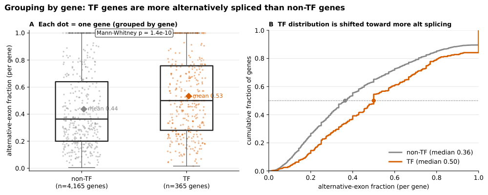</a>

| | |
|---|---|
| File | [`figures/genomic/fig13_gene_grouping_alt_fraction.pdf`](figures/genomic/fig13_gene_grouping_alt_fraction.pdf) |
| Shows | Per gene: share of exon rows that are alternative; TF 365 vs non-TF 4,165 genes (medians 0.50 vs 0.36); box/strip and cumulative distribution. |
| Statistics | Two-sided MWU p=1.4e-10. |
| Made by | `scripts/figures/fig13_gene_grouping_alt_fraction.py` |
| Notes | RECONSTRUCTION: the original code was lost; every value printed on the original figure is reproduced. Alternative exon = present in some but not all of the gene's mapped transcripts (exon_usage). Rows are isoform x exon, so constitutive exons count once per isoform; with unique exons p=3.7e-11. With the GENCODE-wide definition there is no difference (p=0.86). |
| Poster | yes |
| Paper | not decided |

### G6

**As G5, panel A only**

<a href="figures/genomic/fig13a_altfraction_boxplot.pdf">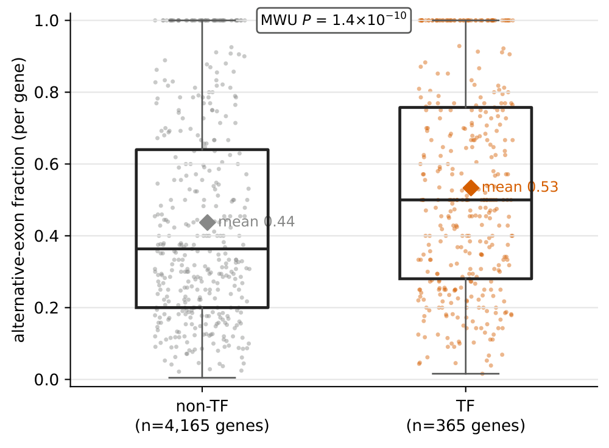</a>

| | |
|---|---|
| File | [`figures/genomic/fig13a_altfraction_boxplot.pdf`](figures/genomic/fig13a_altfraction_boxplot.pdf) |
| Shows | Panel A of G5 as a standalone figure. |
| Statistics | Two-sided MWU p=1.4e-10. |
| Made by | `scripts/figures/fig13_gene_grouping_alt_fraction.py` |
| Notes | As G5. |
| Poster | yes |
| Paper | not decided |

### G7

**Splicing and IDRs in TFs vs non-TFs: four panels**

<a href="figures/genomic/fig12_tf_vs_nontf_splicing.pdf">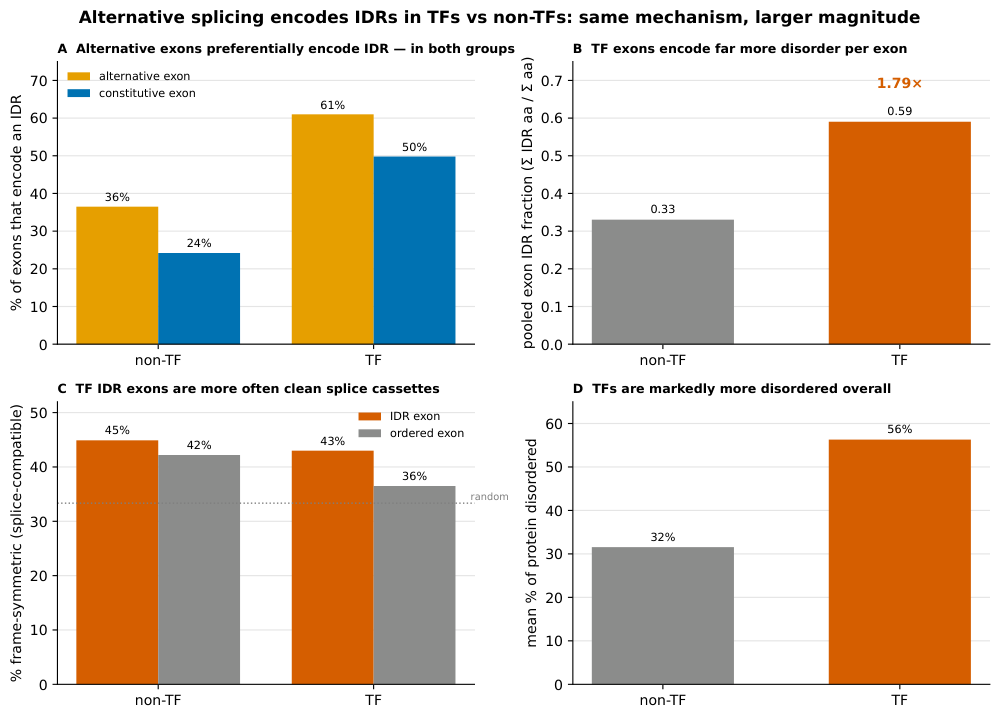</a>

| | |
|---|---|
| File | [`figures/genomic/fig12_tf_vs_nontf_splicing.pdf`](figures/genomic/fig12_tf_vs_nontf_splicing.pdf) |
| Shows | A: % of exons encoding an IDR, alternative vs constitutive; B: pooled exon IDR fraction (0.33 vs 0.59, 1.79x); C: frame-symmetric internal exons, IDR vs ordered; D: mean %IDR (MAIN). |
| Statistics | Descriptive (values from the s9 statistics tables). |
| Made by | `scripts/figures/genomic_preliminary_fig01_to_fig12.py` |
| Notes | RECONSTRUCTION: the original code was lost; every value printed on the original figure is reproduced. Alternative exon = present in some but not all of the gene's mapped transcripts (exon_usage). Panels repeat G1, G8, G9. |
| Poster | no |
| Paper | not decided |

### G8

**TF exons encode more disorder per exon**

<a href="figures/genomic/fig_exon_idr_fraction_tf.pdf">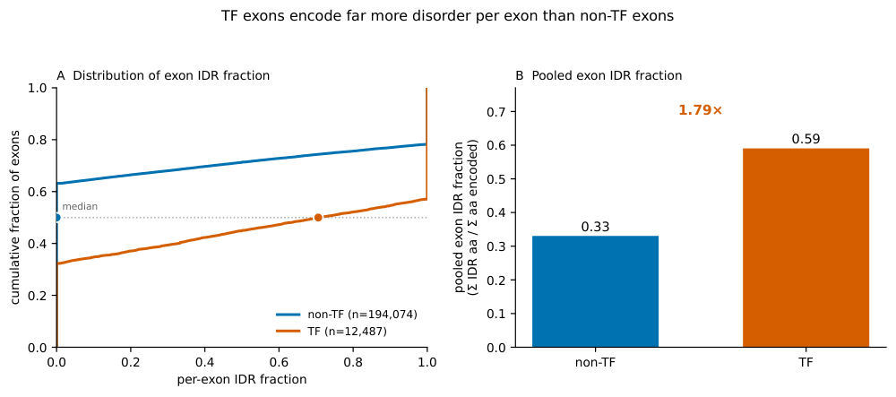</a>

| | |
|---|---|
| File | [`figures/genomic/fig_exon_idr_fraction_tf.pdf`](figures/genomic/fig_exon_idr_fraction_tf.pdf) |
| Shows | Cumulative distribution of per-exon IDR fraction (non-TF 194,074; TF 12,487 exon rows) and pooled exon IDR fraction (0.33 vs 0.59). |
| Statistics | Descriptive. |
| Made by | `pipeline/tfidr_pipeline/stages/s9_splicing_idr_analysis.py` |
| Notes | — |
| Poster | no |
| Paper | not decided |

### G9

**Splicing modulates IDRs: mechanism summary**

<a href="figures/genomic/fig_splicing_idr_mechanism.pdf">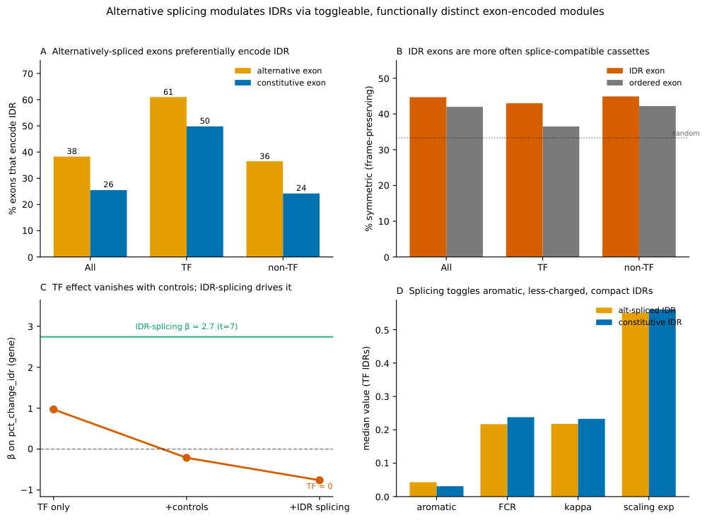</a>

| | |
|---|---|
| File | [`figures/genomic/fig_splicing_idr_mechanism.pdf`](figures/genomic/fig_splicing_idr_mechanism.pdf) |
| Shows | A: IDR-encoding alternative vs constitutive exons; B: frame-symmetric IDR vs ordered exons; C: gene-level OLS coefficient of TF on %IDR range as controls and IDR-splicing are added; D: median properties of alternatively spliced vs constitutive TF IDRs. |
| Statistics | Gene-paired tests and nested OLS (s9). |
| Made by | `pipeline/tfidr_pipeline/stages/s9_splicing_idr_analysis.py` |
| Notes | Alternative exon = present in some but not all of the gene's mapped transcripts (exon_usage). Panel C's title says the TF effect 'vanishes' and IDR-splicing 'drives' it, but the unadjusted TF coefficient is itself not significant (beta=0.97, t=0.80; with controls -0.21; plus IDR-splicing -0.76, whose own beta=2.74, t=7.2). This is an association, not mediation. |
| Poster | no |
| Paper | not decided |

### G10

**Splice-event types and their IDR consequence**

<a href="figures/genomic/fig_splice_event_idr.pdf">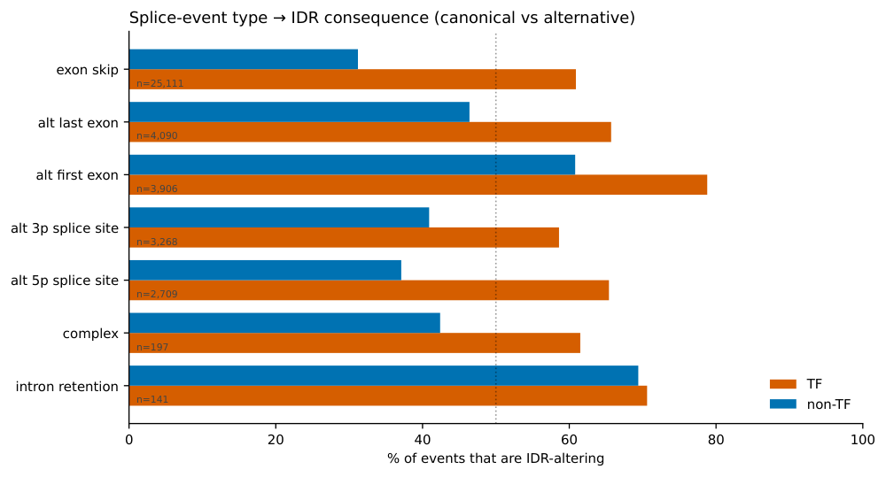</a>

| | |
|---|---|
| File | [`figures/genomic/fig_splice_event_idr.pdf`](figures/genomic/fig_splice_event_idr.pdf) |
| Shows | Canonical vs alternative isoform pairs: % of events of each type (exon skip, alternative first/last exon, alternative 5'/3' site, intron retention, complex) that alter an IDR, TF vs non-TF. |
| Statistics | Descriptive. |
| Made by | `pipeline/tfidr_pipeline/mapping/classify_splice_events.py` |
| Notes | — |
| Poster | no |
| Paper | not decided |

### G11

**IDR exons conserved, removed or added (all / TF / non-TF)**

<a href="figures/genomic/fig15_idr_gain_loss_by_tf.pdf">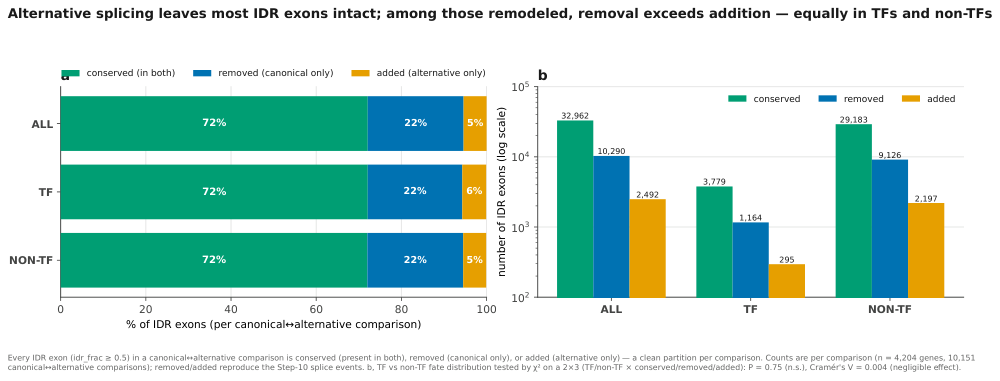</a>

| | |
|---|---|
| File | [`figures/genomic/fig15_idr_gain_loss_by_tf.pdf`](figures/genomic/fig15_idr_gain_loss_by_tf.pdf) |
| Shows | Per canonical-alternative comparison, IDR exons conserved in both, removed (canonical only) or added (alternative only): 72% / 22% / 5-6% in every group. |
| Statistics | chi-square 2x3 TF vs non-TF: P=0.75, Cramer's V=0.004. |
| Made by | `pipeline/tfidr_pipeline/stages/s10b_idr_gain_loss.py` |
| Notes | 'Removed' is relative to the canonical isoform, not evolutionary loss. |
| Poster | no |
| Paper | not decided |

### G12

**As G11, TF and non-TF only**

<a href="figures/genomic/fig15_idr_gain_loss_tf_vs_nontf.pdf">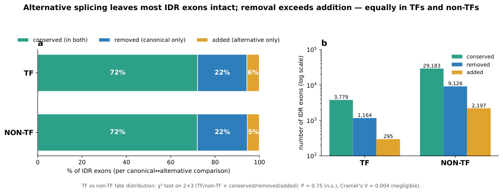</a>

| | |
|---|---|
| File | [`figures/genomic/fig15_idr_gain_loss_tf_vs_nontf.pdf`](figures/genomic/fig15_idr_gain_loss_tf_vs_nontf.pdf) |
| Shows | G11 without the ALL row (TF: 3,779 conserved, 1,164 removed, 295 added). |
| Statistics | chi-square 2x3: P=0.75. |
| Made by | `scripts/figures/fig15_idr_gain_loss_tf_vs_nontf.py` |
| Notes | Recovered script. Poster version of G11. |
| Poster | yes |
| Paper | not decided |

### G13

**Aromatic and charged residues of added vs removed IDR exons**

<a href="figures/genomic/fig_splice_idr_sticker_grammar.pdf">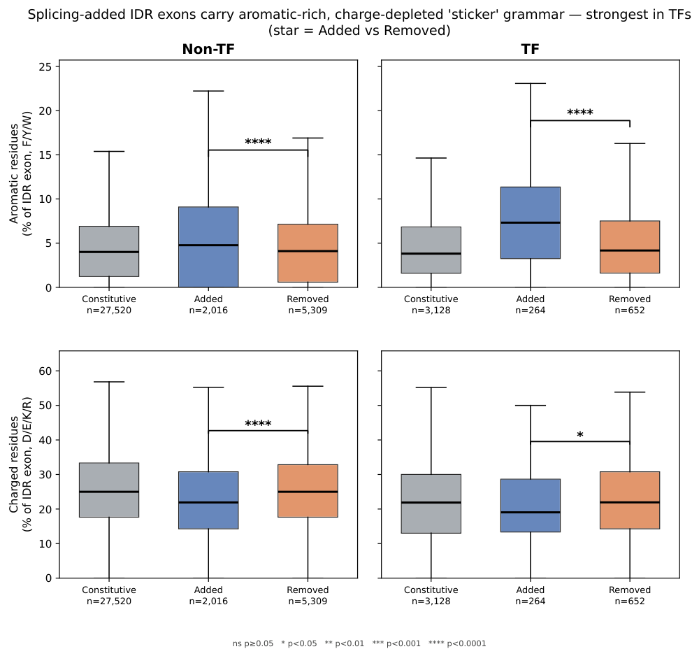</a>

| | |
|---|---|
| File | [`figures/genomic/fig_splice_idr_sticker_grammar.pdf`](figures/genomic/fig_splice_idr_sticker_grammar.pdf) |
| Shows | Unique IDR exons: aromatic (F/Y/W) and charged (D/E/K/R) residue fractions of constitutive, added and removed IDR exons, non-TF and TF. |
| Statistics | MWU added vs removed (4 tests, stars): aromatic ****/****, charged ****/*. |
| Made by | `scripts/figures/fig_splice_idr_sticker_grammar.py` |
| Notes | Recovered script. Alternative exon = present in some but not all of the gene's mapped transcripts (exon_usage). Added exons are shorter (median 24 vs 38 aa); only the 25-aa-binned check in the script's output controls for length. |
| Poster | no |
| Paper | not decided |

## Function: GO enrichment (cluster only)

| ID | Figure | Poster | Paper |
|---|---|---|---|
| [H1](#h1) | Canonical %IDR of high-variation genes |  |  |
| [H2](#h2) | GO enrichment of high-variation genes (full BP ontology) |  |  |
| [H3](#h3) | GO enrichment, BP levels 2-3 |  |  |
| [H4](#h4) | GO enrichment, BP levels 3-4 |  |  |

### H1

**Canonical %IDR of high-variation genes**

<a href="figures/go_enrichment/Q4_canonical_disorder_TF_and_NonTF.pdf">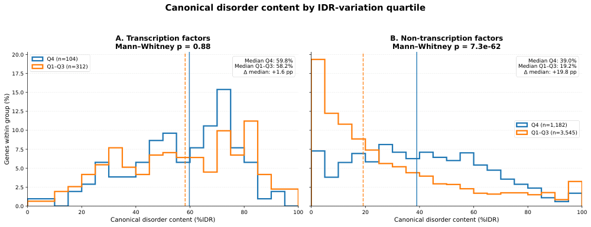</a>

| | |
|---|---|
| File | [`figures/go_enrichment/Q4_canonical_disorder_TF_and_NonTF.pdf`](figures/go_enrichment/Q4_canonical_disorder_TF_and_NonTF.pdf) |
| Shows | Genes in the top quartile of %IDR range (Q4) vs Q1-Q3: canonical %IDR, TF (104 vs 312) and non-TF (1,182 vs 3,545). |
| Statistics | MWU: TF p=0.88; non-TF p=7.3e-62. |
| Made by | `notebooks/go_enrichment_CLUSTER_ONLY` |
| Notes | Made on the AKEY cluster; not regenerated by run.py. |
| Poster | no |
| Paper | not decided |

### H2

**GO enrichment of high-variation genes (full BP ontology)**

<a href="figures/go_enrichment/Q4_TF_and_NonTF_full_GO_BP.pdf">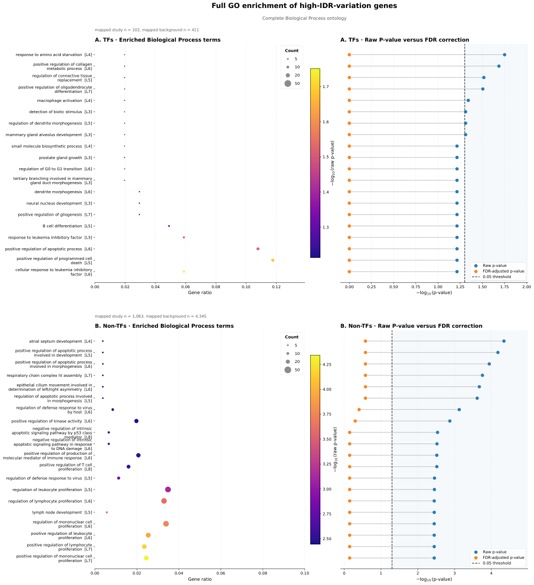</a>

| | |
|---|---|
| File | [`figures/go_enrichment/Q4_TF_and_NonTF_full_GO_BP.pdf`](figures/go_enrichment/Q4_TF_and_NonTF_full_GO_BP.pdf) |
| Shows | goatools enrichment of Q4 genes against the cohort, TF and non-TF: top biological-process terms with gene ratio, and raw vs FDR-adjusted p. |
| Statistics | Fisher/goatools with FDR correction. |
| Made by | `notebooks/go_enrichment_CLUSTER_ONLY` |
| Notes | Cluster only. In every plotted term the FDR-adjusted p (orange) falls short of the 0.05 line; terms are ranked by raw p. |
| Poster | no |
| Paper | not decided |

### H3

**GO enrichment, BP levels 2-3**

<a href="figures/go_enrichment/Q4_TF_and_NonTF_GO_BP_levels_2_3.pdf">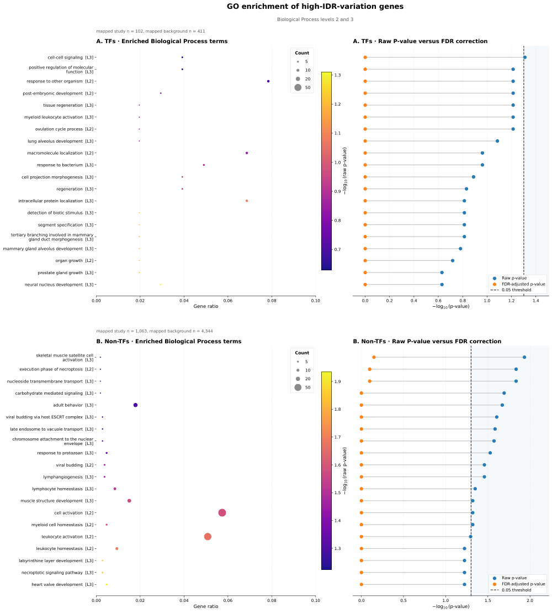</a>

| | |
|---|---|
| File | [`figures/go_enrichment/Q4_TF_and_NonTF_GO_BP_levels_2_3.pdf`](figures/go_enrichment/Q4_TF_and_NonTF_GO_BP_levels_2_3.pdf) |
| Shows | As H2 restricted to GO levels 2-3. |
| Statistics | As H2. |
| Made by | `notebooks/go_enrichment_CLUSTER_ONLY` |
| Notes | As H2. |
| Poster | no |
| Paper | not decided |

### H4

**GO enrichment, BP levels 3-4**

<a href="figures/go_enrichment/Q4_TF_and_NonTF_GO_BP_levels_3_4.pdf">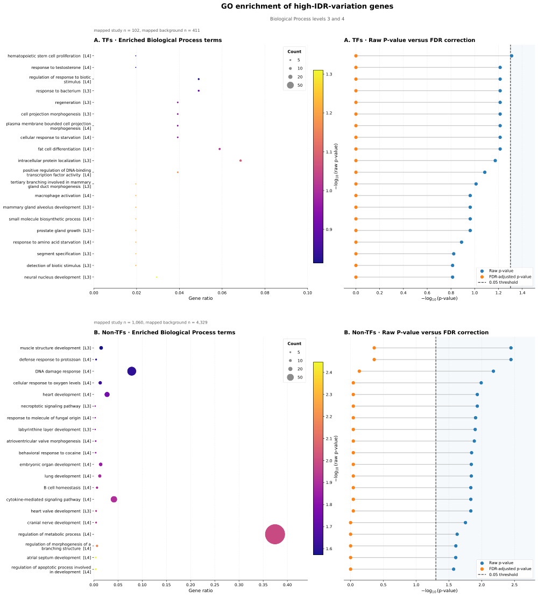</a>

| | |
|---|---|
| File | [`figures/go_enrichment/Q4_TF_and_NonTF_GO_BP_levels_3_4.pdf`](figures/go_enrichment/Q4_TF_and_NonTF_GO_BP_levels_3_4.pdf) |
| Shows | As H2 restricted to GO levels 3-4. |
| Statistics | As H2. |
| Made by | `notebooks/go_enrichment_CLUSTER_ONLY` |
| Notes | As H2. |
| Poster | no |
| Paper | not decided |

